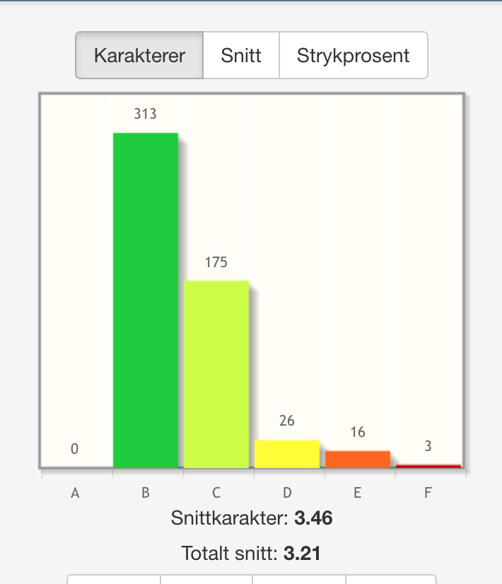

# Kjappe fakta
- Oppmøte i *1/13* forelesninger. Det var én for mye.
- Ta dette faget om du trenger å ha ett fag mindre i semestere. Virkelig, arbeidsmengden er ikke-eksisterende. 
- Du får ikke A.  

# Svar på samtlige spørsmål på [Memorizer](https://memorizer.io/HLS0001/all/1)

## Eksamen H12
***Spørsmål 1***  
**Hvem lanserte begrepet generalized resistance resources (GRRs)?**  
> Aaron Antonovsky  

***Spørsmål 2***  
**I følge senere tids skoleforskning; Hva synes å ha størst betydning for gutters skoletrivsel?**  
> Det å ha mange kompiser på skolen  

***Spørsmål 3***  
**Teorien om self-transcendence (ST) relatrerer ST til noen sentrale begrep. Hvilke?**  
> Velvære (wellbeing) og sårbarhet  

***Spørsmål 4***  
**Opplevelse av sammenheng OAS(SOC, engelsk forkortelse) har tre dimensjoner. Hva er viktigst å ta i betraktning når man skal evaluere OAS?**  
> Dimensjonen meningsfullhet  

***Spørsmål 5***  
**I tråd med Aaron Antonovsky er Salutogenese først og fremst**  
> En systemteori | En individteori  

***Spørsmål 6***  
**Helsefremmende arbeid (HFA) i tråd med med WHOs Ottawa-charter (1986) betrakter helse som...**  
> En tilstand av velvære  

***Spørsmål 7***  
**Hvilken av følgende setninger beskriver best hvordan helse påvirkes av den kulturelle konteksten vi vokser opp i?**  
> Kulturen påvirker hvordan vi opplever oss selv og vår forhold til verden rundt oss. Det kan derfor være fundamentale forskjeller i hvordan helse oppleves, noe som gjør seg utslag i hvordan vi prøver å oppnå god helse, hvem vi søker hjelp hos og hvilke valg vi tar.  

***Spørsmål 8***  
**Hvilken av de følgende omstendigheter er IKKE en vanlig grunn for varig nedsatt helse etter en migrasjon?**  
> At man blir utsatt for uvante bakterier og virus  

***Spørsmål 9***  
**Hvilket begre er spesielt sentralt i forbindelse med utvikling av opplevelse av sammenheng (SOC)?**  
> Generelle motstandsressurser  

***Spørsmål 10***  
**Hva er en stress-moderator?**  
> Faktorer som påvirker retningen og styrken mellom stress og en annen variabel  

***Spørsmål 11***  
**Hvilken stressteoretiker beskrev 'det generelle adaptasjonssyndromet' (GAS)?**  
> Hans Selye  

***Spørsmål 12***  
**Den biopsykososiale sykdomsmodellen (Espnes og Smedslund, 2001) viser at det åndelige systemet kan ha betydning for helseutvikling i relasjon til...**  
> Det psykologiske, biologiske og sosiale systemet, samt i systemet for samspill mellom kroppslige og fysiske symptomer (psyche- soma)  

***Spørsmål 13***  
**Et av svaralternativene nedenfor blir hevdet å være viktigst for å oppleve god livskvalitet. Hvilket?**  
> At man har gode og nære relasjoner med venner og familie.  

***Spørsmål 14***  
**Den mest anerkjente og brukte definisjonen på utbrenthet er forfattet av Maslach. Hun deler utbrenthet inn i?**  
> Tre dimensjoner  

***Spørsmål 15***  
**Med psykosomatisk forskning menes?**  
> Helseforskning som søker å se på hvordan menneskers helse utvikles som en sum av de faktorer, indre og ytre, som det påvirkes av.  

***Spørsmål 16***  
**Hva er i følge Holmes og Rahe's forskning den mest stressende livshendelse?**  
> Dødsfall hos ektefelle.  

***Spørsmål 17***  
**At en undersøkelse har god validitet vil si...**  
> At undersøkelsen måler det den er ment å måle.  

***Spørsmål 18***  
**At en undersøkelse har god reliabilitet vil si...**  
> At undersøkelsen er pålitelig.  

***Spørsmål 19***  
**Andelen av nordmenn som driver med fysisk aktivitet på fritiden siden 1940 og frem til i dag varierer fra...**  
> 40 - 60 %  

***Spørsmål 20***  
**KAP-modellen er en viden brukt helseatferdmodell. K står for 'knowledge', A for 'attitude' og P for 'practice' (kunnskap, holdning, atferd). Hva har vært den vanligste kritikken mot denne modellens gangbarhet?**  
> At den er for tydelig på at den rekkefølgen bare går en vei.  

***Spørsmål 21***  
**Hvilken type religionsdefinisjon kan Sigmund Freud sies å primært vektlegge i boken 'A future of an Illusion' (1927)?**  
> En funksjonell religionsdefinisjon.  

***Spørsmål 22***  
**Å betrakte helse som en ressurs innebærer å se på helse som:**  
> Evnen til å utvikle motstandsressurser som kan fremme livsmot, livsglede og mestring av hverdagslivets ulike situasjoner.  

***Spørsmål 23***  
**Å måle individers livskvalitet er vanskelig først og fremst fordi:**  
> Det er en subjektiv opplevelse som favner alle sider ved vår tilværelse.  

***Spørsmål 24***  
**Forskjellen på helsefremming og forebyggende helsearbeid er at:**  
> Helsefremming handler om å legge til rette for at individet, i samspill med sine omgivelser, kan ta ansvar for å fremme egen helse, mens forebyggende helsearbeid handler om å redusere risikofaktorer for sykdom.  

***Spørsmål 25***  
**Hva er definisjonen av positiv psykologi?**  
> Det vitenskapelige studiet av optimal fungering.  

***Spørsmål 26***  
**Hva mente Antonovsky med begrepet 'Sence of Coherence'?**  
> En meningsfull sammenheng i tilværelsen.  

***Spørsmål 27***  
**Hva kjennetegner såkalte 'løvetannbarn'?**  
> At de har hatt dårlige oppvekstvilkår og klart seg bra.  

***Spørsmål 28***  
**Hvilke metoder foretrekker helsepsykologien å fokusere på i arbeidet?**  
> Helsefremming og forebygging.  

***Spørsmål 29***  
**Det finnes ulike sykdoms- og helsemodeller. Helsepsykologer og forskere som arbeider med psykosomatikk benytter seg vanligvis av den mest moderne av disse modellene og den kalles for...**  
> bio-psyko-sosial helsemodell.  

***Spørsmål 30***  
**Definisjonen av folkehelsearbeidet lyder som følger: 'Folkehelsearbeidet er samfunnets innsats for å påvirke faktorer som direkte eller indirekte fremmer befolkningens helse og trivsel, forebygger psykisk og somatisk sykdom, skade eller lidelse, eller som beskytter mot helsetrusler, samt arbeid for en jevnere fordeling av faktorer som direkte eller indirekte påvirke helsen.' Forebyggende arbeid deles inn i 3 kategorier, men ikke alt er folkehelsearbeid. Hvilken av de følgende påstandene om forebyggende arbeid er en del av folkehelsearbeidet:**  
> Universelt (primærforebyggende) og selektivt (sekundærforebyggende) forebyggende arbeidet i symptomfri fase og fasen tidlig intervensjon er en del av folkehelsearbeidet.   

***Spørsmål 31***  
**Hvilke lovverk forankrer Folkehelsearbeidet, listet i bestemmende rekkefølge:**  
> Plan og bygningsloven, Folkehelseloven og Helse- og omsorgstjenesteloven  

***Spørsmål 32***  
**Arbeidet for å redusere sosiale helseforskjeller vil kreve langsiktig og målrettet innsats på mange områder. I følge Nasjonal strategi for å utjevne sosiale helseforskjeller - innledning til Stortingsmelding nr. 20 (2006 - 2007) er dette de viktigste innsatsområder for å følge utviklingen:**  
> Inntekt, oppvekst, arbeid og arbeidsmiljø, helseatferd, helsetjenester, sosial inkludering.  

***Spørsmål 33***  
**Begrepet dualisme...**  
> stammer fra en overbevisning om at mennesket består av to adskilte deler, kropp og en sjel.  

***Spørsmål 34***  
**Den kognitive terapimodellen kjennetegnes ved...**  
> - et særskilt fokus på til dels uløste emosjonelle konflikter.
> - at tanker, følelser og kroppslige symptomer, samt atferd henger sammen og påvirker hverandre. 
> - at man er spesielt opptatt av lært atferd, og ser på denne atferden som noe som kan avlæres.     

***Spørsmål 35***  
**George Stone (1987) mener at de ulike helsedefinisjonene grovt sett faller innenfor to kategorier: Hvilke?**  
> Noen definerer helse som en ideell tilstand, mens de andre definerer helse som en bevegelse i en positiv retning.  

***Spørsmål 36***  
**Med self-efficacy eller mestringsforventning på norsk mener Albert Bandura:**  
> at sannsynligheten for at vi skal gjøre noe, øker proporsjonalt med den troen vi har på at vi vil få det til.  

***Spørsmål 37***  
**I det psykonevroimmunologiske perspektivet er en opptatt av...**  
> hvordan psykiske lidelser og sykdommer påvirker immunforsvaret.  

***Spørsmål 38***  
**Albert Banduras (1969, 1977) sosial- kognitive teori skiller seg ut fra klassisk behaviorisme på flere områder. Hvilken påstand stemmer IKKE?**  
> Banduras vektla like mye forholder i samfunnet rundt individet for å forklare atferd.  

***Spørsmål 39***  
**Hvilken vei var det vanlig å tenke seg årsak og virkning når det gjaldt psykisk - fysiske problemer, symptomer og sykdommer i romertiden?**  
> Fysiske problemer slo ut i psykiske symptomer.  

***Spørsmål 40***  
**Korrelasjonsstudier benyttes ofte i helseforskning. Hva er den viktigste svakheten med slike studier?**  
> En kan ikke dra årsak-virkningskonklusjoner fra slike studier.  

***Spørsmål 41***  
**Primærforebgygende helsearbeid har som mål å**  
> Redusere risikofaktorer og styrke motstandskraft  

***Spørsmål 42***  
**Sammenheng mellom uavhengig og avhengig variabel i eksperimenter er...**  
> Den uavhengige variabelen er den en bevisst varierer.  

## Eksamen V09

***Spørsmål 43***  
**Helsepsykologien kjennetegnes ved at den er...**  
> ser på mennesket som en helhet  

***Spørsmål 44***  
**... er en relativt stabil disposisjon knyttet til spesielle atferdsmessige mønster (Epstein, 1977). Er en definisjon av...**  
> et personlighetstrekk  

***Spørsmål 45***  
**Med en bio-psyko-sosial helsemodell menes**  
> en modell som tar inn både biologiske, psykologisk og sosiale faktorer i forklaringen av utviklingen av helse.  

***Spørsmål 46***  
**I psykomatikk og helsepsykologi benyttes ulike metoder og instrumenter for å samle data om ulike forskjeller eller sammenhenger. En sier at en slik metode er valig når den:**  
> måler eksakt det en ønsker å måle.  

***Spørsmål 47***  
**Lazarus og Selye er kjent for sine teorier om**  
> stress  

***Spørsmål 48***  
**Type a atferdsmønster er blitt forbundet med utviklingen av en bestemt sykdom. Det er:**  
> hjerteinfarkt  

***Spørsmål 49***  
**I hvilken landsdel i Norge er selvmordsforekomsten lavest?**  
> vestlandet  

***Spørsmål 50***  
**I Oslo har det ofte tidligere vært snakk om at forventet levetid er høyere i vest enn i øst. Nye undersøkelser viser at:**  
> det fortsatt er slik  

***Spørsmål 51***  
**Er det farlig å snakke om selvmord?**  
> Nei, men det er viktig hvilken måte man snakker om det på.  

***Spørsmål 52***  
**Det synspunktet at menneskelige fenomener (f.eks. ærlighet og depresjon) grunnleggende sett er det samme (kvalitativt) i alle kulturer kalles:**  
> universalisme  

***Spørsmål 53***  
**En person med type B atferdsmønster**  
> tar livet som det kommer, lar seg ofte flyte med i livsstrømmen.  

***Spørsmål 54***  
**En kultur der sykdom blir sett på som forårsaket av faktorer i det enkelte individ kalles:**  
> individualistisk  

***Spørsmål 55***  
**Det finnes ulike sykdoms- og helsemodeller. Helsepsykologer og forskere som arbeider med psykomatikk benytter se gvanligvis av den mest moderne modellen, og dne kales for:**  
> bio-psyko-sosial helsemodell  

***Spørsmål 56***  
**Det er minst fire måter å beskrive forholdet mellom helse og livskvalitet. En av de er mer dekkende enn andre. Hvilken?**  
> helse og livskvalitet kan være overlappende begreper med en felles kjerne.  

***Spørsmål 57***  
**Livskvalitet er et lett forståelig begrep. Er det også lett å måle i vitenskapelige studier? Hvilket alternativ er riktig?**  
> Nei, livskvalitet er komplisert å måle fordi begrepet er multi-dimensjonalt. Det er et fenomen under kontinuerlig endring, og det innebefatter en subjektiv opplevelse av å ha det godt eller dårlig.  

***Spørsmål 58***  
**'Det generelle adaptasjonssyndromet' (GAS) som begrep**  
> stammer fra Selyes beskrivelse av reaksjoner på stress.  

***Spørsmål 59***  
**Hvem regnes som utbrenthetbegrepets 'far' og skrev de første artiklene?**  
> Freudenberger  

***Spørsmål 60***  
**Utbrenthet skiller seg fra andre begreper som depresjon og stress fordi**  
> utbrenthet er arbeidsrelatert og mer kronisk.  

***Spørsmål 61***  
**Den mest anerkjente og brukte definisjonen på utbrenthet er laget av Maslach. Hun deler utbrenthet inn i:**  
> tre dimensjoner  

***Spørsmål 62***  
**Nyere oppsummering av forskningsstatur vedrørende strategier for reduksjon av alkoholrelaterte skader i samfunnet, viser at en strategi som har høy grad av effekt er:**  
> selvhjelpsgrupper  

***Spørsmål 63***  
**Totalforbruksteorien handler om**  
> totalforbruket er den dominerende faktor som styrer alkoholskadenes omfang i samfunnet, men ikke den eneste faktor.  

***Spørsmål 64***  
**Hvilke av personlighetstrekkene nedenfor er sterkest relatert til rapportering av symptomer**  
> nevrotisisme  

***Spørsmål 65***  
**Hva kjennetegner, ifølge Friedman og kollegaer, personer som lever lenge?**  
> de scorer lavt på optimisme og høyt på planmessighet  

***Spørsmål 66***  
**Med forkortningen BMI**  
> mener vi vanligvis Body Mass Index  

***Spørsmål 67***  
**Innen medisin og sykepleie defineres 'livskvalitet' oftest som:**  
> fysisk, psykisk, sosialt og materielt velvære  

***Spørsmål 68***  
**Livskvalitet måles oftest ved hjelp av**  
> selvrapportering  

***Spørsmål 69***  
**De fleste som må fjerne livmoren lider av:**  
> smerter og store blødninger  

***Spørsmål 70***  
**De fleste 'cancer survivors' opplever en god livskvalitet fordi:**  
> oppfatningen av hva som er viktigst i livet endres  

***Spørsmål 71***  
**Det finnes forskjellige risikofaktorer knyttet til enkeltindividers helseutvikling i vestlige land i dag. Hvilken vurderes å være den skumleste i nær fremtid?**  
> økende overvekt.  

***Spørsmål 72***  
**Et måleinstrument med høy reliabilitet er:**  
> et instrument som vil gi samme resultat hver gang gitt at det som blir målt var det samme.  

## Diverse

***Spørsmål 73***  
**I 1980 definerte helsepsykologen Matarazzo helsepsykologi som:**  
> Det samlede bidrag psykologien gir for å forstå helse og velvære.  

***Spørsmål 74***  
**Hvilke metoder foretrekker helsepsykologien å fokusere på i arbeidet?**  
> helsefremming og forebygging  

***Spørsmål 75***  
**Hvor lang tid omtrent har helsepsykologi eksistert som egen disiplin her i landet?**  
> ca. 10 år  

***Spørsmål 76***  
**I psykosomatikk og helsepsykologi benyttes ulike metoder og instrumenter for å samle data om ulike forskjeller eller sammenhenger. En sier at en slik metode er valid når den:**  
> måler eksakt det en ønsker å måle  

***Spørsmål 77***  
**Type A atferdsmønster er blitt forbundet med utviklingen av en bestemt sykdom. Det er:**  
> hjerteinfarkt  

***Spørsmål 78***  
**I Oslo har det ofte tidligere vært snakk om at forventet levetid er høyere vest i byen enn øst i byen. I de nyeste undersøkelsene viser det seg at nå er dette slik at:**  
> alt er som før  

***Spørsmål 79***  
**En person med type B atferdsmønster**  
> tar livet som det kommer og lar seg flyte med livsstrømmen  

***Spørsmål 80***  
**Det finnes ulike sykdoms- og helsemodeller. Helsepsykologer og forskere som arbeider med psykosomatikk benytter seg vanligvis av den mest moderne av disse modellene og kalles for**  
> bio-psyko-sosial helsemodell  

***Spørsmål 81***  
**Det er minst fire måter å beskrive forholdet mellom helse og livskvalitet. En av de fire måtene nedenfor er mest dekkende. Hvilken?**  
> helse og livskvalitet kan være overlappende begreper med en felles kjerne  

***Spørsmål 82***  
**Et av svaralternativene nedenfor blir hevdet å være viktigst for å oppleve en god livskvalitet. Hvilket?**  
> at man har gode og nære relasjoner med familie og venner  

***Spørsmål 83***  
**Livskvalitet er et lett forståelig begrep. Er det også lett å måle i vitenskapelige studier? Et av svaralternativene nedenfor er riktig. Hvilket?**  
> Nei, livskvalitet er komplisert å måle fordi begrepet er multidimensjonalt, det er et fenomen under kontinuerlig endring, og det innbefatter en subjektiv opplevelse av å ha det godt eller dårlig.  

***Spørsmål 84***  
**Har økningen i levekår og inntekt i vår del av verden de siste 50 årene bidratt til økt lykkefølelse?**  
> nei, til tross for at vi har hatt en sterk økning i levekår og personlig inntekt de siste 50 årene, har lykkefølelsen holdt seg omtrent konstant.  

***Spørsmål 85***  
**Utbrenthet skiller seg fra andre begrep som depresjon og stress fordi**  
> utbrenthet er arbeidsrelatert og mer kronisk  

***Spørsmål 87***  
**Den mest anerkjente og brukte definisjonen på utbrenthet er forfattet av Maslach. Hun deler utbrentheten inn i?**  
> tre dimensjoner  

***Spørsmål 87***  
**Hvilke av personlighetstrekkene nedenfor er sterkest relatert til rapportering av symptomer?**  
> nevrotisisme  

***Spørsmål 88***  
**Hva kjennetegner, i følge Friedman og kollegaer, personer som lever lenge?**  
> de scorer lavt på optimisme og høyt på planmessighet (conscientiousness)  

***Spørsmål 89***  
**Livskvalitet har vært et kjent begrep i:**  
> 30 - 40 år (økonomisk oppsving)  

***Spørsmål 90***  
**Innen medisin og sykepleie defineres 'livskvalitet' oftest som:**  
> fysisk, psykisk, sosialt og materielt velvære  

***Spørsmål 91***  
**Livskvalitet måles oftest ved hjelp av:**  
> selvrapportering  

***Spørsmål 92***  
**De fleste som må fjerne livmoren lider av:**  
> smerter og store blødninger  

***Spørsmål 93***  
**For de fleste kvinner som får fjernet livmoren blir helsen:**  
> bedre  

***Spørsmål 94***  
**Å fjerne livmoren fører ofte til komplikasjoner som:**  
> ingen komplikasjoner  

***Spørsmål 95***  
**De fleste 'cancer survivors' opplever en god livskvalitet fordi:**  
> oppfatningen av hva som er viktig i livet endres  

***Spørsmål 96***  
**Det finnes forskjellige risikofaktorer knyttet til enkeltindividers helseutvikling i vestlige land i dag. Hvilken blir vurdert til å være den skumleste i nærmeste framtid?**  
> økende overvekt  

***Spørsmål 97***  
**Med psykosomatisk forskning menes?**  
> helseforskning som søker å se på hvordan menneskers helse utvikles som en sum av de faktorer, indre og ytre, som det påvirkes av  

***Spørsmål 98***  
**Et måleinstrument med høy relabilitet er:**  
> et instrument som vil gi samme resultat hver gang gitt at det som blir målt var det samme  

***Spørsmål 99***  
**Claudius Galnus (129 - 200) ofte referert til som Galen er kjent som:**  
> lege og vitenskapsmann fra Lilleasia (Tyrkia)  

***Spørsmål 100***  
**Hvilken vei var det vanlig å tenke seg årsak og virkning når det gjaldt psykisk-fysiske problemer, symptomer og sykdommer i romeritden?**  
> fysiske problemer slo ut i psykiske symptomer  

***Spørsmål 101***  
**Hippokrates - kjent lege fra det gamle Hellas, mente at personer med mye svart galle var**  
> melankolske (depressive)  

***Spørsmål 102***  
**Begrepet dualisme...:**  
> stammer fra en overbevisning om at mennesket består av to adskilte deler, kropp og en sjel  

***Spørsmål 103***  
**Hva mente filosofen og psykologen William James (1842 - 1910) med at vi var på sporet av en slags 'matematisk verdensformel'?**  
> en formel som i prinsippet ville gjøre det mulig å forutsi all framtid med fullkommen nøyaktighet. Dette gjaldt alle hendelser i omgivelsene så vel som i oss selv  

***Spørsmål 104***  
**Hva menes med begrepet reduksjonisme?**  
> reduksjonismen hvedet at 'sjelen' ikke var noe annet enn nerveimpulser i hjernen  

***Spørsmål 105***  
**George Stone (1987) mener at de ulike helsedefinisjonene grovt sett faller innenfor to kategorier. Hvilke?**  
> Noen definerer helse som en ideell tilstand, mens de andre definerer helse som en bevegelse i positiv retning  

***Spørsmål 106***  
**Forskjellen på bio-medisinsk-sykdomsmodell og den bio-psyko-sosiale-helse- og sykdomsmodell kan grovt sett sies å være at:**  
> Biopsykososiale-modellen er den mest moderne og tar med flere elementer for utvikling av helse og sykdom  

***Spørsmål 107***  
**I 1926 utgav Sigmund Freud avhandlingen Henunung, Symptom und Angst. Hva var det med den avhandlingen som var spesielt for arbeidet i psykosomatikken?**  
> Han mente at agnst kunne betraktes som et forebyggende varselsignal for andre sykdommer.  

***Spørsmål 108***  
**'Er det usunt å spise egg?' kan være ... forskning.**  
> en problemstilling for  

***Spørsmål 109***  
**Å gjøre en problemstilling forskar kalles for å ...**  
> operasjonalisere problemet  

***Spørsmål 110***  
**Sammenheng mellom uavhengig og avhengig variabel i eksperimenter er**  
> den uavhengige variabelen er den en bevisst varierer  

***Spørsmål 111***  
**Klassisk kasus-kontrollstudier kjennetegnes ved at en har:**  
> en gruppe som naturlig eller eksperimentelt utsettes for et eller annet og som har en kontrollgruppe
  

***Spørsmål 112***  
**Hvilket ord mangler? '... er enhver aktivitet hos en person som oppfatter seg som frisk, og hvor målet er å forebygge sykdom eller oppdage sykdom før den bryter ut.'**  
> helseatferd  

***Spørsmål 113***  
**Hva er den grunnleggende hensikten med vaksinasjon?**  
> at de som vaksineres skal utvikle resistens  

***Spørsmål 114***  
**KAP-modellen er en viden brukt helseatferdmodell. K står for knowledge, A for attitude og P for pratice (kunnskap, holdning og atferd). Hva har vært den vanligste kritikken mot denne modellens gangbarhet?**  
> at den er for tydelig på at den rekkefølgen går bare en vei  

***Spørsmål 115***  
**Med Self-Efficacy eller mestringsforventning på norsk mener Albert Bandura...:**  
> at sannsynligheten for at vi skal gjøre noe, øker proporsjonalt med den troen vi har på at vi vil få det til  

***Spørsmål 116***  
**I en artikkel fra 2000 bryjer Taylor og medarbeidere uttrykket 'tend and befriend'. Med dette uttrykket forsøker Taylor og medarbeidere å beskrive...:**  
> kjønnsforskjeller i responser på stress - dette er kvinnenes typiske respons  

***Spørsmål 117***  
**Hva er i følge Homes og Rahe's forskning den mest stressende livshendelse?**  
> dødsfall hos ektefelle.  

***Spørsmål 118***  
**Hva menes i helsepsykologien med begrepet 'The Big Five'?**  
> de 5 hovedfaktorene som beskriver vår personlighet  

***Spørsmål 119***  
**Hvilke ord mangler? '... har samme formål å redusere forekomsten av sykdommer, skader, sosiale problemer, død og risikofaktorer.**  
> forebyggende tiltak.  

***Spørsmål 120***  
**Korrelasjonsstudier benyttes ofte i helseforskning. Hva er den største svakheten med slike studier?**  
> en kan ikke dra årsak-virknings-konklusjoner fra slike studier.  

***Spørsmål 121***  
**Sommeren 2008 kom en artikkel fra den kjente forskeren Martin Seligman. Her foreslo han et nytt forskningsfelt. Hva var det?**  
> positive health  

***Spørsmål 122***  
**Helsepsykologien kjennetegnes ved at den er**  
> ser på mennesket som en helhet  

***Spørsmål 123***  
**... er en relativt stabil disposisjon knyttet til spesielle atferdsmessige mønstre (Epstein 1977). Er en definisjon av...**  
> et personlighetstrekk  

***Spørsmål 124***  
**Med en bio-psyko-sosial helsemodell menes:**  
> en modell som tar inn både biologiske, psykologiske og sosiale faktorer i forklaringen av utvikling av helse  

***Spørsmål 125***  
**I psykosomatikk og helsepsykologi benyttes ulike metoder og instrumenter for å samle data om ulike forskjeller eller sammenhenger. En sier at en slik metode er valid når den:**  
> måler eksakt det en ønsker å måle

***Spørsmål 126***  
**Lazarus og Selye er kjent for sine teorier om ...**  
> stress  

***Spørsmål 127***  
**Type A atferdsmønster er blitt forbundet med utviklingen av en bestemt sykdom. Det er:**  
> hjerteinfarkt  

***Spørsmål 128***  
**Er det farlig å snakke om selvmord?**  
> nei, men det er viktig hvilken måte man snakker om det på  

***Spørsmål 129***  
**En kultur der sykdom blir sett på som forårsaket av faktorer i det enkelte individet kalles:**  
> individualistisk  

***Spørsmål 130***  
**'Det generelle adaptasjonssyndromet' (GAS) som begrep...**  
> stammer fra Seyles beskrivelse av reaksjoner på stress  

***Spørsmål 131***  
**Hvem regnes som Utbrenthetsbegrepets 'far' og skrev de første artiklene?**  
> Freudenberger  

***Spørsmål 132***  
**Utbrenthet skiller seg fra andre begrep som depresjon og stress fordi**  
> utbrenthet er arbeidsrelatert og mer kronisk  

***Spørsmål 133***  
**Nyere oppsummering av forskningsstatus vedrørende strategier for reduksjonen av alkoholrelaterte skader i samfunnet viser at en strategi som har høy grad av effekt er:**  
> selvhjelpsgrupper/alkoholopplsning i skolen  

***Spørsmål 134***  
**Totalforbruksteorien handler om ...**  
> totalforbruket er den dominerende faktor som styrer alkoholskadene omfang i samfunnet, men ikke den eneste faktor  

***Spørsmål 135***  
**Med forkortningen BMI**  
> mener vi vanligvis Body Mass Index  

***Spørsmål 136***  
**Det musikalske elementet som i størst grad påvirker hjernens plastivitet er:**  
> Klangfarge  

***Spørsmål 137***  
**Opplevelse av sammenheng (Sense of coherence (SOC)) er et viktig element i teorien om salutgenese. I dette**  
> Forståelighet, påvirkelighet, meningsfulhet  

## Eksamen H13

***Spørsmål 138***  
**Det finnes ulike sykdoms- og helsemodeller. Helsepsykologer og forskere som arbeider med psykosomatikk benytter seg vanligvis av den mest moderne av disse modellene og kalles for ..**  
> bio-psyko-sosial helsemodell  

***Spørsmål 139***  
**Forskjellen på helsefremming og forebyggende helsearbeid er at:**  
> Helsefremming handler om å legge til rette for at individet, i samspill med sine omgivelser, kan ta ansvar for å fremme egen helse, mens forebyggende helsearbeid handler om å redusere risikofaktorer for sykdom.  

***Spørsmål 140***  
**Å gjøre en problemstilling forskbar kalles for å ...**  
> operasjonalisere problemstillingen.  

***Spørsmål 141***  
**Hvem er opprinnelsen til begrepet 'sense of coherence'?**  
> Aaron Antonovsky  

***Spørsmål 142***  
**Data fra ungdomsdel en av Helseundersøkelsen Nord-Trøndelag, Ung-HUNT, viser at elever med frafall i videregående skole har større sjanse for å bli langtidssykemeldt/uføretrygdet. Sjansen for å bli langtidssykemeldt/uføretrygdet for de med frafall sammenlignet med de som fullfører er:**  
> Tre-fire ganger så høy  

***Spørsmål 143***  
**Frafall i videregående skole er et samfunnsproblem, og det er sammenheng mellom helse og frafall. I hvilken helseregion ligger det fylket som hadde størst gjennomstrømming (fullført og bestått etter 5 år) av elever i perioden 2002-2004-2006?**  
> Helse Vest  

***Spørsmål 144***  
**Her presenteres en påstand: 'Rike mennesker ser ut til å være mer lykkelig enn andre'. Denne påstanden er fiølge Firebaugh (2005):**  
> Riktig, og det er om du tjener mer enn jevnaldrende som har betydning.  

***Spørsmål 145***  
**John Gunnar Mæland er opptatt av begrepene helse og livskvalitet. Mener han at:**  
> Helse og livskvalitet er overlappende, og vi har behov for begge begrepene i forskning.  

***Spørsmål 146***  
**Albert Banduras (1969, 1977) sosial- kognitive teori skiller seg ut fra klassisk behaviorisme på flere områder. Hvilken påstand stemmer IKKE?**  
> Bandura vektla like mye forholder i samfunnet rundt individet for å forklare atferd  

***Spørsmål 147***  
**Primærforebyggende helsearbeid har som mål å...**  
> Redusere risikofaktorer og styrke motstandskraft  

***Spørsmål 148***  
**Hva kjennetegner såkalte 'løvetannbarn'?**  
> At de har vokst opp med dårlige oppvekstsvilkår og klart seg bra  

***Spørsmål 149***  
**Hva menes med begrepet ”Sense of Coherence”?**  
> En meningsfull sammenheng i tilværelsen  

***Spørsmål 150***  
**Hva er definisjonen av positiv psykologi?**  
> Det vitenskapelige studiet av optimalfungering  

***Spørsmål 151***  
**Medisinsk screening betyr at man...**  
> Leter etter sykdom i en befolkning uten symptomer.  

***Spørsmål 152***  
**Hvilket av utsagnene under er feil?**  
> En frisk person som får et positivt screeningresultat har fått riktig resultat.  

***Spørsmål 153***  
**Det raskest voksende alderssegmentet er mennesker over...**  
> 80 år  

***Spørsmål 154***  
**Ifølge Folkehelserapporten (Folkehelseinstituttet,2010) viser forskning at det prosentvise antallet av 15-16 år gamle gutters symptomer på angst og depresjon ligger på:**  
> Mellom 13-15 %  

***Spørsmål 155***  
**Ifølge Folkehelserapporten (Folkehelseinstituttet,2010) viser forskning at det prosentvise antallet av 15-16 år gamle jenters symptomer på angst og depresjon ligger på:**  
> Mellom 31-35 %  

***Spørsmål 156***  
**Ifølge senere tids skoleforskning; Hva synes å ha størst betydning for gutters skoletrivsel?**  
> det å ha mange kompiser på skolen  

***Spørsmål 157***  
**Hvem lanserte begrepet generalized resistance resources (GRRs)?**  
> Aaron Antonovsky  

***Spørsmål 158***  
**Walter Cannon (1932) var en av de første i moderne forskningssammenheng som for alvor ble interessert i...**  
> Stressorer  

***Spørsmål 159***  
**Aaron Wildavsky er opphavet til en regel som lyder; ”Det er bare 10% av folks helseproblemer helsetjenesten kan gjøre noe med. De resterende 90 % må løses utenfor helsetjenesten ved at folk får bedre livsstil og ved bedring av de generelle livsvilkårene” Hva kalles regelen?**  
> 10-90 regelen  

***Spørsmål 160***  
**I år 1993 var forekomsten av fedme (BMI over 30) hos norske 9-åringer 0,9 %. Hva var de samme verdiene i år 2000?**  
> 3.6%  

***Spørsmål 161***  
**Ifølge nyere forskning (Høie, 2005) er gjennomsnittlig levetid på et sykehjem:**  
> 2 - 3 år  

***Spørsmål 162***  
**Et av de viktigste teoretiske begrepene innenfor helsepsykologien er self-efficacy eller mestringsforventning. Hvem innførte dette begrepet?**  
> Albert Bandura  

***Spørsmål 163***  
**Med self-efficacy eller mestringsforventning på norsk menes...**  
> at sannsynligheten for at vi skal gjøre noe, øker proporsjonalt med den troen vi har på at vi vil få det til.  

***Spørsmål 164***  
**Livskvalitet har vært et kjent begrep i:**  
> 30-40 år (økonomisk oppsving)  

***Spørsmål 165***  
**KAP-modellen er en ofte brukt helseatferdmodell. K står for knowledge, A for attitude og P for practice (kunnskap, holdning og atferd). Hva har vært den vanligste kritikken mot denne modellens gangbarhet?**  
> At den er for tydelig på at den rekkefølgen bare går en vei.  

***Spørsmål 166***  
**I tråd med Aaron Antonovsky er Salutogenese først og fremst...**  
> en systemteori  

***Spørsmål 167***  
**Hvilket begrep er spesielt sentralt i forbindelse med utvikling av opplevelse av sammenheng (SOC)?**  
> Generelle motstandsressurser  

***Spørsmål 168***  
**Hvilken type religionsdefinisjon kan Sigmund Freud sies å primært vekt legge i boken ”A future of an lllusion” skrevet i 1927?**  
> en funksjonell religionsdefinisjon  

***Spørsmål 169***  
**Å betrakte helse som en ressurs innebærer å se på helse som:**  
> Evnen til å utvikle motstandsressurser som kan fremme livsmot, livsglede og mestring av hverdagslivets ulike situasjoner.  

***Spørsmål 170***  
**Definisjonen av folkehelsearbeidet lyder som følger: ”Folkehelsearbeidet er samfunnets innsats for å påvirke faktorer som direkte eller indirekte fremmer befolkningens helse og trivsel, forebygger psykisk og somatisk sykdom, skade eller lidelse, eller som beskytter mot helsetrusler, samt arbeid for en jevnere fordeling av faktorer som direkte eller indirekte påvirker helsen.” Forebyggende arbeid deles inn i 3 kategorier men ikke alt er folkehelsearbeid. Hvilken av de følgende påstandene om forebyggende arbeid er en del av folkehelsearbeidet?**  
> Universelt (primærforebyggende) og selektivt (sekundærforebyggende) forebyggende arbeid i symptomfri fase og fasen tidlig intervensjon er en del av folkehelsearbeidet.  

***Spørsmål 171***  
**Hvilke lovverk forankrer Folkehelsearbeidet, listet i bestemmende rekkefølge:**  
> Plan- og bygningsloven, Folkehelseloven og Helse- og omsorgstjenesteloven  

***Spørsmål 172***  
**Psykiske lidelser koster det norske samfunnet ca. 72 milliarder kroner per år, noe som er mer enn driftskostnadene totalt for forsvaret. Den største delen av kostnadene er såkalte indirekte kostnader. Hva skulle gi den beste helsefremmende effekten for å få ned disse kostnadene?**  
> Høykvalitets barnehage  

***Spørsmål 173***  
**Helsinki-deklarasjonen er..**  
> Forskningsetiske retningslinjer  

***Spørsmål 174***  
**NEO-PI-R er et verktøy for å måle:**  
> Personlighetsfaktorer  

***Spørsmål 175***  
**At en undersøkelse har god validitet vil si...**  
> at undersøkelsen måler det den er ment å måle  

***Spørsmål 176***  
**At en undersøkelse har god reliabilitet vil si...**  
> at undersøkelsen er pålitelig  

***Spørsmål 177***  
**Sosial mobilitet er et begrep som er direkte knyttet til...**  
> Sosiale klasser  

***Spørsmål 178***  
**Uttrykket ”den epidemiologiske overgangen” viser til...**  
> En forandring i befolkningshelse  

***Spørsmål 179***  
**Verdens første internasjonale konferanse om helsefremming ble holdt i...**  
> Ottawa i 1986  

***Spørsmål 180***  
**Sommeren 2008 kom en artikkel fra den kjente forskeren Martin Seligman. Her foreslo han et nytt forskningsfelt. Hva var det?**  
> positive health  

***Spørsmål 181***  
**I 2003 truet ”noen” WHO (verdens helseorganisasjon) med å oppfordre den amerikanske kongressen til å trekke tilbake sin støtte til WHO på 406 millioner. Trusselen kom på bakgrunn av en rapport. Hva handlet rapporten om?**  
> Diett og ernæring  

***Spørsmål 182***  
**Hva er ”myalgisk encefalopati” et annet navn for?**  
> Kronisk tretthetssyndrom  

***Spørsmål 183***  
**”Hawthorne-effekten” viser…**  
> At vissheten om at man blir observert har effekt  

***Spørsmål 184***  
**Sosialgerontologi omfatter de…**  
> Psykologiske, sosiologiske og sosiale aspektene ved aldring  

***Spørsmål 185***  
**Bergensprosjektet som pågikk fra 1993-1996, hadde til hensikt…**  
> Å få langtidssykemeldte tilbake på jobb  

***Spørsmål 186***  
**Hva forklarer Lipostaseteorien?**  
> At det er samspillet mellom hormoner som er den viktigeste forklaringen på overvekt  

***Spørsmål 187***  
**Selyes forsket på stress, og hans arbeid kan sammenfattes under begrepet ”det generelle adaptasjonssyndromet” (GAS). GAS rommer tre stadier. Hvilket av de følgende begrepene er IKKE ett av disse tre?**  
> Normalisering  

# Forelesning 1

**Hva er helse?**  
*Helse er å kunne mestre de utfordringer dagen gir.*

**Helseutfordringer i Norge og verden:**  
1. Ikke-smittsomme sykdommer
2. Vi blir flere eldre og opplever aldersdiskrimminering. 
3. Det er et økende press på unge.
4. Ulikheter - skjevfordeling og mangel på integrering
5. Antibiotikaresistens.
6. Migrasjon.

 

**Ikke-smittsome sykdommer: (NCD)**  
Fortsatt infeksjoner og spebarndød.

* FN og WHO har startet med å fokusere på NCD som et verdensproblem i fremtiden.
* Livsstilssykdommer som har vært et problem i vestlige land i mange år er nå et globalt problem.
* Sykdommene er menneskeskapte, samfunnsskapte og symptomer på de samfunnene vi lever i.

>Overvekt er et økende problem.  
> - Kan skyldes at hverdagsaktiviteten minker.

Tradisjonell helseforskning er preget av vitenskaper som undersøker hva som gjør oss syke, men for å løse våre største helseutfordringer trenger vi mer forskning på hva som gjør oss friske. **Samfunnsvitenskapelige miljøer må inn i helseforskningen**.

**Alderdiskrimminering:**  
- I 2050 vil prosentandelen av mennesker som er 80 og eldre være 31% mot 18% i 1980.
- Om 30 år er antallet over 65 år mer en doblet (1,3 mrd)
- *Hvordan kan man utvikle samfunnsstrukturer og systemer som kan legge til rette for at mennesker skal oppleve å ha god helse på sine gamle dager?

>Hva sier gamle mennesker om situasjonen?  
- De ønsker å bli sett på som en ressurs. De vil ta ansvar.
- Vil delta i meningsfulle aktiviteter.
- Mulighet til å besøke venner.
- *GOD HELSE*
- Ønsker en følelse av trygghet
- Ikke bli 'gjort med', ikke bli behandlet som passive mottakere.

> Lag et samfunn som passer gamle, da passer det for alle.

**Presset på unge:**  
- Dårlig mestringsfølelse.
- Økende mentale problemer.
- Færre fullfører VGS (50% frafall i Finnmark)

**Ulikheter:**  
- Mellom individer, grupper nasjoner og regioner.
- Syd-Europa: Lost generation, - arbeidsledighet.
- Ensomhetsfølelse blant gamle og unge.
- Migrasjon for arbeid og et bedre liv, - flukt fra fattigdom og katastrofer.

 