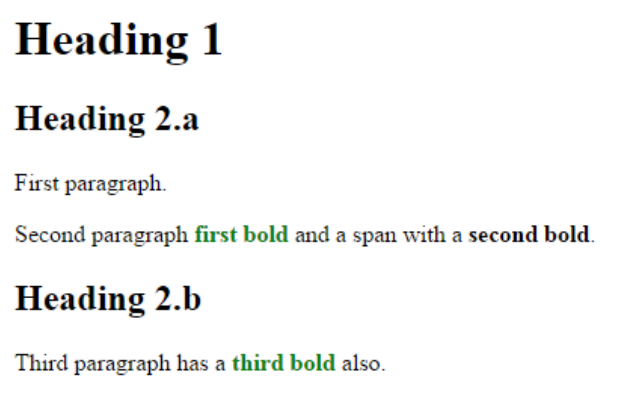

# IT2805 - Web Technologies: Exam 2015
## Section A: Multiple Choice Questions (30%)

1. The elements ```<div>``` and ```<span>``` have the following characteristics (2%)
    - Element ```<div>``` inherits properties defined for ```<span>``` in a stylesheet
    - ```<div>``` and ```<span>``` have no real meanings as html tags unless stylesheet is applied
    - ***Elements ```<span>``` and ```<div>``` define content to be inline or block-level***
    - ```<div>``` and ```<span>``` are used as alternatives for the element ```<p>```
    - ```<div>``` is used inside element ```<p>```.

2. In regards to the CSS box model, where is the margin property located? (2%)
    - Inside the box
    - ***Outside the box***
    - inside or outside depending on where you put it in your code
    - None of the above

3. Which built-in HTML5 object is used to draw on the canvas? (2%)
    - ***getContext***
    - getContent
    - getGraphics
    - getCanvas
    
4. Which primitive shape is supported by ```<canvas>```? (2%)
    - Cycle
    - ***Rectangle***
    - Polygon
    - Triangle
    
5. While working on a JavaScript project, which function would you use to send messages to
users requesting for text input? (2%)
	 - Display()
	 - ***Prompt()***
	 - Alert()
	 - GetInput()
	 - Confirm()

6. Which protocol is ideal for transmitting large files? (2%)
	 - HTTP
	 - ***FTP***
	 - SMTP
	 - RTP

7. In HTML tables, the number of columns is determined by (2%)
	 - ***how many ```<td>``` elements are inserted within each row***
	 - the width attribute of the ```<tr>``` element
	 - the ```<col>``` element
	 - none of the above

8. If you'd like visited links to be green, unvisited links to be blue, and links that the mouse is over to be red, which CSS rules will you use? (2%)
	 - a:visited { color: green } a:unvisited { color: blue } a:mouseover { color: red }
	 - ***a:link { color: blue } a:visited { color: green } a:hover { color: red }***
	 - a:hover { color: red } a:visited { color: green } a:link { color: blue }
	 - a:active { color: green } a:link { color: blue } a:hover { color: red }

9. From outside to inside, a box (block) has: (2%)
	 - border, margins, padding
	 - margins, padding, border
	 - padding, margins, border
	 - ***margins, border, padding***

10. The difference between margins and padding is.. (2%)
	 - indistinguishable if there's no border
	 - ***margin does not have a background color***
	 - padding is measured in EM; margins in PX;
	 - there is no difference

11. What is the default value of the position property? (2%)
	 - relative
	 - absolute
	 - fixed
	 - ***static***

12. Which HTML attribute specifies an alternate text for an image, if the image cannot be
displayed? (2%)
	 - src
	 - title
	 - ***alt***
	 - longdesc

13. Indicate whether each of the following statements is True or False (1% each - 6%)
	 - [TRUE] This a "well formed" XML document:
		```XML
			<?xml version="1.0" encoding="UTF-8"?>
			<book1>
				<isbn>1234567890</isbn>
				<name>XML Master Basic >2006&lt;</name>
			</book1>
		```
	 - [FALSE] In a hierarchical structure, each page is linked with the pages that follow and precede it in an ordered chain 
	 - [TRUE] In HTML5 ```<video>``` element you don’t need to supply values for all attributes, eg, control, loop; these attributes are on when they are there and off in case they don’t.
	 - [TRUE] Pseudo-class selects an element based on a state the element is in
	 - [TRUE] POST requests are never cached
	 - [FALSE] GET requests cannot be bookmarked

## Section B: Longer Answer Questions (30%)

1. You’re creating a music web site with the following folder and file structure:
	
Give the relative URL for each of the following connections (1% each - 4%):

	- From cd-used.html to stones.html (1%)  
		```../genre/rock/classic/stones.html```
	- From icecube.html to ramones.html (1%)  
		```../rock/punk/ramones.html```
	- From doors.html to stones.html (1%)  
		```./stones.html```
	- From index.html to DMX.html (1%)  
		```./genre/rap/DMX.html```

2. Fill in the following sentences: (1% each word - 8%)
	- The ***GIF*** image format tends to be good for drawn graphics and animations, but the ***JPEG*** format is good for photos.

	- If you want to control which element sits on the top you use the ***Z-index*** property. The (***higher***/lower) value z-index property has the closer that element is to the front.
	
	- You can concatenate ***STRINGS*** together with the + operator.
	
	- To link to an external JavaScript file from HTML, you need the ***src*** attribute for the ```<script>``` element.		
	
	- A parameter acts like a ***local*** variable in the body of a function.

	- The IP addresses are provided by ***Domain Name Server (DNS)*** that map symbolic names to their IP.

3. Name each of the 4 required parts of a CSS rule and very briefly (one sentence) state the purpose of each part (4%)
	- ***Selector***, identifies the HTML tag to be styled
	- ***Declaration***, encapsulates Properties/values pairs
	- ***Property***, identifies the style attribute to be styled
	- ***Value***, specifies the value to set the Property to

4. Name each of the 4 layers of the TCP/IP model and very briefly (one sentence) state the purpose of each part (4%).
	- ***The Application Layer*** provides applications the ability to access the services of the other layers and defines the protocols that applications use to exchange data, includes protocols such as the HyperText Transfer Protocol (HTTP) and the Domain Name System (DNS).

	- ***The Transport Layer*** is responsible for making sure that complete messages are delivered end to end, using the Transmission Control Protocol (TCP) or User Datagram Protocol (UDP).

	- ***The Network/Internet Layer ***is responsible for routing messages from one place to another; all	routers on the Internet run the IP protocol.

	- The bottom layer is the ***Physical Layer***. This is responsible for actually translating the software message into a physical representation and putting them on the wire (or through the air in a	wireless network or fiber-optic wire).

5. Answer the following questions. (2% each - 6%)
	```JavaScript
	var temp = 81;
	var willRain = true;
	var humid = (temp > 80 && willRain == true);
	```

	- What is the value of humid? ***true***

	```JavaScript
	var guess = 6;
	var isValid = (guess >= 0 && guess <= 6);
	```

	- What is the value of isValid? ***true***

	```JavaScript
	var kB = 1287;
	var tooBig = (kB > 1000);
	var urgent = true;
	var sendFile = (urgent == true || tooBig == false);
	```

	- What is the value of sendFile? ***true***


6. What is the result of the following code? (2%)
	```JavaScript
	var x = 7;
	var y = 5;
	var z = 14;
	x = y;
	z = z % x;
	alert(y + z); // 9 
	```
7. What is the result of the following code? (2%)
	```JavaScript
	var a = 1;
	a = a + 1;
	var b = "a is " + a;
	a = 5;
	alert(b); // 'a is 2'
	```

## Section C: Coding Related Questions (40%)
1. Develop a web-form to collect the following information (4%): 
	- name of the student
	- his/her email address

2. Consider the following HTML file:
	```HTML
	<html>
	<head>
	<style>
	…
	</style>
	</head>
	<body>
	 <h1> Heading 1</h1>
	 <h2> Heading 2.a</h2>
	 <p> First paragraph. </p>
	 <p> Second paragraph <b>first bold</b> and a <span>span with a <b>second bold</b></span>.</p>
	 <h2> Heading 2.b</h2>
	 <p> Third paragraph has a <b>third bold</b> also. </p>
	</body
	</html>
	```

	- Build (draw) the Document / HTML tree of the code above (1%)
	- Write the CSS rules needed to produce the outcome shown below. The words  “first bold” and “third bold” shall be green (may not be visible on your question sheet in case of b/w print) (2%)

		

		(b) Write the CSS rule needed to produce the outcome shown below. The lines “First paragraph” and “Third paragraph has a third bold too” shall be green (may not be visible on your question sheet in case of b/w print) (2%)

		

3. Consider the following HTML:
	```HTML
	<p> Lorem ipsum dolor…</p>
	```

	Write the CSS rules needed to (4%):  
	1. Change the font for the sentence to fantasy  
	2. Change its size to 24px.  
	3. Make the text bold  
	4. Make the text italics

4. Consider the following JavaScript code:
	```JavaScript
	var days = [Sunday, Monday, Tuesday, Wednesday, Thursday, Friday, Saturday];
	var today = new Date().getDay();
	for (var i=1; i<7; i++) {
	 if (i = today) {
	  document.write("Today is " days[today] "<br>");
	 }
	 else {
	  document.write("Today is not " days[today] " “<br>” );
	 }
	}  
	```

	- Identify FIVE TYPES of errors in the code (don’t write more than a sentence per error). Note that each type of error may occur at more than one point in the code. This counts as a single
error. Write the correct code. (5%)
	- Explain the effect that each error would cause when the script is run. (5%)
	- Show what the corrected code would output. (2%)

5. Write some JavaScript that uses the current clock and tells whether class is over (class ends 12:20). (5%)

6. Write JavaScript code to draw the following figure inside a ```<canvas>``` element: Don’t forget to access the canvas element from your script and use the 2D drawing API. We expect you to approximately draw the following figure, eg. bigger eyes, face not centered to the canvas etc. are not problems. (10%)

	

	```HTML
	<!DOCTYPE html>
	<html> <body>
	<canvas id="myCanvas" width="150" height="150" style="border:1px solid #d3d3d3;">
	Your browser does not support the HTML5 canvas tag.</canvas>
	<script>
	…
	</script>
	</body> </html>
	```