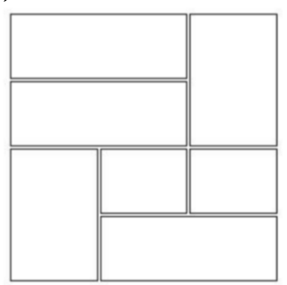
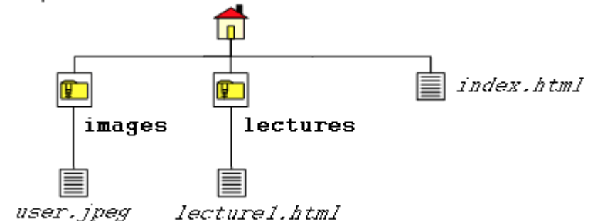

# IT2805 - Web Technologies: Exam 2016

## Section A: Multiple Choice Questions (30%)

1. **What is the correct HTML for making a text input field? (2%)**
    - ```<input type="textfield">```
    - ```<textfield>```
    - **```<input type="text">```**
    - ```<textinput type="text">```

2. **How do you display hyperlinks without an underline? (2%)**
    - a {decoration:no-underline;}
    - **a {text-decoration:none;}**
    - a {underline:none;}
    - a {text-decoration:no-underline;}

3. **How do you display a border like this: (2%)**  
    The top border = 10 pixels  
    The bottom border = 5 pixels  
    The left border = 20 pixels  
    The right border = 1pixel?   
    - **border-width:10px 1px 5px 20px;**
    - border-width:5px 20px 10px 1px;
    - border-width:10px 20px 5px 1px;
    - border-width:10px 5px 20px 1px;

4. **What is the correct JavaScript syntax to change the content of the HTML element below? (2%)**
    ```HTML
      <p id="demo">This is a demonstration.</p>
    ```
    - **document.getElementById("demo").innerHTML = "Hello World!";**
    - #demo.innerHTML = "Hello World!";
    - document.getElement("p").innerHTML = "Hello World!";
    - document.getElementByName("p").innerHTML = "Hello World!";

5. **If you wanted to round the corners of a block element, which style property would you apply? (2%)**
    - border:
    - border-arc:
    - border-deg:
    - **border-radius:**

6. **Consider the table shown below. Which line of code would create the last row of the table? (2%)**  
      
    - ```<tr><td></td><td rowspan=”2”></td></tr>```
    - ```<tr><td colspan=”2”></td><td rowspan=”2”></td></tr>```
    - ```<tr><td rowspan=”2”></td></tr>```
    - **```<tr><td colspan=”2”></td></tr>```**

7. How many alert boxes will the following loop produce? (2%)
    ```JavaScript
    for ( var Index = 0; Index <= 2; ++Index );
      alert( Index );
    ```
    - 0
    - 1
    - 2 
    - **3**

8. Which of the following is the code for accessing the contents of an input box named userData on a form? 
    - document.forms[0].userData
    - **document.forms[0].userData.value**
    - document.forms[0].userData.contents
    - document.forms[0].userData.data

9. Given a file structure in the figure below, if you are working on the source code of index.html, which of the following is the correct relative URL for lecture1.html? (2%)
    
    - lecture1.html
    - **lectures/lecture1.html**
    - ../lectures/lecture1.html
    - ./lecture1.html

10. The syntax for adding a textfield of 3 rows, each of width 40 is: (2%)
    - ```<textfield rowspan=”3” colspan=”40”>blah blah</textfield>```
    - ```<textfield rows=”3” width=”40”>blah blah</text>```
    - ```<text row=”3” width=”40”>blah blah</text>```
    - **```<textarea rows=”3” cols=”40”>blah blah</textarea>```**

11. Indicate whether each of the following statements is True or False (1.5% each - 6%)
   - **[TRUE]** This is a valid JSON.
      ```JSON
        {
        "id": 1,
        "name": "A green door",
        "price": 12.50,
        "tags": ["home", "green"]
        }
        ```
    - **[FALSE]** In an HTML form, the method attribute is used to specify the script file that processes the
    form data
    - **[FALSE]** Domain Name Servers map symbolic computer names to their host names
    - **[FALSE]** XML elements cannot be empty