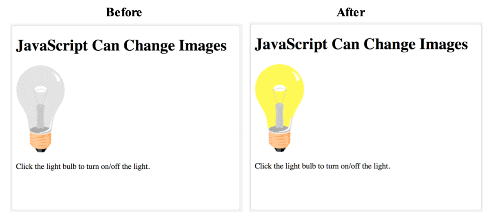
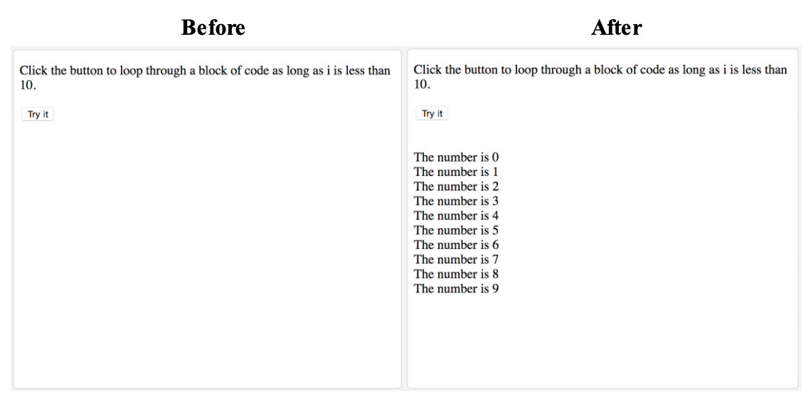
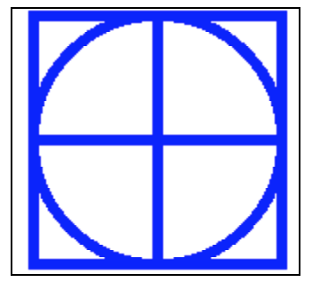

# IT2805 - Web Technologies: Exam 2016

## Section A: Multiple Choice Questions (30%)

1. **What is the correct HTML for making a text input field? (2%)**
    - ```<input type="textfield">```
    - ```<textfield>```
    - **```<input type="text">```**
    - ```<textinput type="text">```

2. **How do you display hyperlinks without an underline? (2%)**
    - a {decoration:no-underline;}
    - **a {text-decoration:none;}**
    - a {underline:none;}
    - a {text-decoration:no-underline;}

3. **How do you display a border like this: (2%)**  
    The top border = 10 pixels  
    The bottom border = 5 pixels  
    The left border = 20 pixels  
    The right border = 1pixel?   
    - **border-width:10px 1px 5px 20px;**
    - border-width:5px 20px 10px 1px;
    - border-width:10px 20px 5px 1px;
    - border-width:10px 5px 20px 1px;

4. **What is the correct JavaScript syntax to change the content of the HTML element below? (2%)**
    ```HTML
      <p id="demo">This is a demonstration.</p>
    ```
    - **document.getElementById("demo").innerHTML = "Hello World!";**
    - #demo.innerHTML = "Hello World!";
    - document.getElement("p").innerHTML = "Hello World!";
    - document.getElementByName("p").innerHTML = "Hello World!";

5. **If you wanted to round the corners of a block element, which style property would you apply? (2%)**
    - border:
    - border-arc:
    - border-deg:
    - **border-radius:**

6. **Consider the table shown below. Which line of code would create the last row of the table? (2%)**  
      
    - ```<tr><td></td><td rowspan=”2”></td></tr>```
    - ```<tr><td colspan=”2”></td><td rowspan=”2”></td></tr>```
    - ```<tr><td rowspan=”2”></td></tr>```
    - **```<tr><td colspan=”2”></td></tr>```**

7. **How many alert boxes will the following loop produce? (2%)**
    ```JavaScript
    for ( var Index = 0; Index <= 2; ++Index );
      alert( Index );
    ```
    - 0
    - 1
    - 2 
    - **3**

8. **Which of the following is the code for accessing the contents of an input box named userData on a form?**
    - document.forms[0].userData
    - **document.forms[0].userData.value**
    - document.forms[0].userData.contents
    - document.forms[0].userData.data

9. **Given a file structure in the figure below, if you are working on the source code of index.html, which of the following is the correct relative URL for lecture1.html? (2%)**
    
    - lecture1.html
    - **lectures/lecture1.html**
    - ../lectures/lecture1.html
    - ./lecture1.html

10. **The syntax for adding a textfield of 3 rows, each of width 40 is: (2%)**
    - ```<textfield rowspan=”3” colspan=”40”>blah blah</textfield>```
    - ```<textfield rows=”3” width=”40”>blah blah</text>```
    - ```<text row=”3” width=”40”>blah blah</text>```
    - **```<textarea rows=”3” cols=”40”>blah blah</textarea>```**

11. **Indicate whether each of the following statements is True or False (1.5% each - 6%)**
   - **[TRUE]** This is a valid JSON.
      ```JSON
        {
        "id": 1,
        "name": "A green door",
        "price": 12.50,
        "tags": ["home", "green"]
        }
        ```
    - **[FALSE]** In an HTML form, the method attribute is used to specify the script file that processes the
    form data
    - **[FALSE]** Domain Name Servers map symbolic computer names to their host names
    - **[FALSE]** XML elements cannot be empty

12. **What is the output when you run the following programs: . . .(0.5% each – 4%)**
    ```JavaScript
      var i = 25;
      var j = “25”;
      var k = 2 + “5”;
      var l = “2” + “5”;
    ```

    - document.write (i == j); **[TRUE]**
    - document.write (i === j); **[FALSE]**
    - document.write (j == k); **[TRUE]**
    - document.write (j === k); **[TRUE]**
    - document.write (i == k); **[TRUE]**
    - document.write (i === k); **[FALSE]**
    - document.write (k == l); **[TRUE]**
    - document.write (k === l); **[TRUE]**

## Section B: Longer Answer Questions (30%)

1. **Fill in the following gaps: (1.5% each gap - 9%)**
    - The purpose of *[TRANSPORT LAYER / TCP]* is to ensure the integrity of network communication.
    -  *[DYNAMIC]* routing is a technique to select the best route according to the network
    conditions at the time of transmission.
    - What is the required attribute of the ```<video>``` element in HTML5, when the video is in a
    single format? *[SRC]*
    - Consider the following JavaScript statement:
    var myLinks =getElementsByTagName (“a”);
    What is the data type of the result? *[]*.
    - If you want to control which element sits on the top (when elements overlap) you use the 
    *[Z-index]* property.
    - The *[CONTENT]* part of the box (box model), is where text and images appear.

2. **Select all valid XML tag names (1%)**
    - ```[ x ] <_Element1>```
    - ```[ ] <1Tag>```
    - ```[ x ] <My.Element>```
    - ```[ ] <#Elem&ent>```
    - ```[ x ] <My-Element_Name]```
    - ```[  ] <XmL>```

3. **Fill in the empty cells of the table with the correct word (0.3% each field – 3.6%)**
    <table>
      <tr>
        <th>Image Type</th>
        <th>File Extension</th>
        <th>Compression</th>
        <th>Transparency</th>
        <th>Animation</th>
        <th>Colors</th>
      </tr>
        <tr>
        <td>GIF</td>
        <td>.gif</td>
        <td>Lossless</td>
        <td>Yes</td>
        <td>Yes</td>
        <td>Hundreds</td>
      </tr>

      <tr>
        <td>JPEG</td>
        <td>.jpg / .jpeg</td>
        <td>Lossy</td>
        <td>No</td>
        <td>No</td>
        <td>Millions</td>
      </tr>

      <tr>
        <td>PNG</td>
        <td>.png</td>
        <td>Lossless (can be Lossy)</td>
        <td>Yes</td>
        <td>No</td>
        <td>Millions</td>
      </tr>
    </table>


4. **Write the appropriate position property value for each of the following description (1% each - 4%).**
    <table>
      <tr>
        <th>Property Value</th>
        <th>Description</th>
      </tr>

      <tr>
        <td>static</td>
        <td>This is the default setting – no special positioning</td>
      </tr>

      <tr>
        <td>absolute</td>
        <td>The box is taken out of normal flow and no longer affects the position of the other elements.</td>
      </tr>

      <tr>
        <td>relative</td>
        <td>This property value moves an element in relation to where it would have
    been in normal flow</td>
      </tr>

      <tr>
        <td>fixed</td>
        <td>Configures the location of an element within the browser viewpoint – i.e. the element doesn’t change position if scrolling content.</td>
      </tr>

    </table>

5. **Explain the key differences between Canvas and SVG, no need to write more than 4-5 bullet points (4%).**
    - SVG is vector graphics. Canvas is pixels.
    - Canvas elements are drawn programmatically, SVG are parts of the DOM.
    - Canvas does not have built in animations. SVG does.
    - Canvas has high performance for pixel-based drawing operations while SVG is based on standard XML syntax, which provides better accessibility 

6. **Consider the following HTML file:**
    ```HTML
      <!DOCTYPE html>
      <html>
      <head>
      <style>
        /* unvisited link */
        a:link {
          background-color: lightblue;
        }
        /* visited link */
        a:visited {
          background-color: lightblue;
        }
        /* mouse over link */
        a:hover {
          background-color: yellow;
        }
        /* selected link */
        a:active {
          background-color: yellow;
        }
      </style>
      </head>
      <body>
        <h1>This is a Heading</h1>
        <p>This is a paragraph.</p>
        <p><a href="http://www.ntnu.no">NTNU</a></p>
      </body>
      </html>
    ```

    - Build (draw) the Document / HTML tree of the code above (0.4%)
      - body
          - h1
          - p
          - p
            - a
    - Write the CSS Pseudo-Classes needed (4 boxes) to set the background color for visited and unvisited links to "lightblue", and the background color for the mouse over and active links states to "yellow". (8% - 2% each)

## Section C: Coding Related Questions (40%)

1. **Write code for a JavaScript function that: (6% - 1.5% each)**
    - reads in two numbers from an HTML form
    - determines which number is the largest
    - outputs to screen which number is the largest (in the format “44 is larger than 22”) and
    - write an appropriate HTML form which will call this function

      View code [here](./code/task1).

2. **Write a CSS rule that configures a class called “company” in bold, serif font, and 1.25em in size. (2%)**
    ```CSS
        .company {
          font-weight: bold;
          font-family: serif;
          font-size: 1.25em;
        }
    ```

3. **Consider the following HTML:**
    ```HTML
      <!DOCTYPE html>
      <html>
      <head>
      <style>
      …
      </style>
      </head>
        <body>
          <p>In my younger and more vulnerable years my father gave me some advice that I've
          been turning over in my mind ever since. 'Whenever you feel like criticizing anyone,' he
          told me, 'just remember that all the people in this world haven't had the advantages that
          you've had.'</p>
        </body>
      </html>
    ```

    Write the CSS Pseudo-Classes needed to (6% - 2% each):
    - Set text color to red, for the first line of the ```<p>``` element.
      ```CSS
        p::first-line {
          color: red;
        }
      ```
    - Set text color to "blue", and the text size to "xx-large", for the first letter of the ```<p>``` element.
      ```CSS
        p::first-letter {
          color: blue;
          font-size: xx-large;
        }
      ```
    - Insert the image "smiley.gif" before, and after ```<p>``` elements.
    Hint: it will look something like this, we need you to write the two missing CSS PseudoClasses.
      ```CSS
        p::before {
        content: url(smiley.gif);
        }

        p::after {
        content: url(smiley.gif);
        }
      ```

4. **Below is an outline for a JavaScript program that turns on and off the image of a bulb, when clicked, as shown in the before and after pictures below.**
      
    Your task is to fill in the missing JavaScript code so that the program works correctly. Notice that there are two images: pic_bulboff.gif and pic_bulbon.gif. (10% - 2% each box)

    ```HTML
    <!DOCTYPE html>
    <html>
    <body>
      <h1>JavaScript Can Change Images</h1>
      
      <p>Click the light bulb to turn on/off the light.</p>

    <script>
      function changeImage() {
        const image = document.getElementById('myImage');
        if (image.src.match("bulbon") {
          image.src = "pic_bulboff.gif";
        } else {
          image.src = "pic_bulboon.gif";
        }
      }
    </script>
    </body>
    </html>
    ```

5. **Below is an outline for a JavaScript program, with a “Try it” button that,when clicked, produces the output as shown in the before and after pictures below.**
      
    Your task is to fill in the missing JavaScript code so that the program works correctly. You must use a “while” loop statement, as indicated. (10% - 2% each box)

    ```HTML
    <!DOCTYPE html>
    <html>

    <body>
      <p>Click the button to loop through a block of code as long as i is less than 10.</p>

      <button onclick="myFunction()">Try it</button>

      <p id="demo"></p>

      <script>
        function myFunction() {
          let i = 0;
          let text = '';
          while (i < 10) {
            text += (`The number is ${i}\n`);
            i++
          }

          document.getElementById('demo').innerText = text;
        }
      </script>
    </body>
    </html>
    ```

6. **Write JavaScript code to draw the following figure inside a ```<canvas>``` element: Don’t forget to access the canvas element from your script and use the 2D drawing API. We expect you to approximately draw the following figure, eg. line width, not fully centered to the canvas, color of the lines etc. are not problems. (6%)**
    

    View code [here](./code/task6.html).