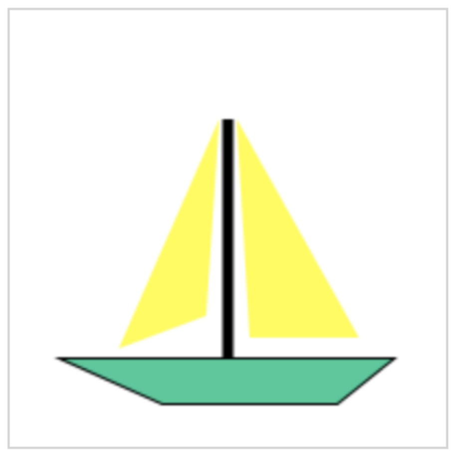

# IT2805 - Web Technologies: Exam 2017

## Section A: Multiple Choice Questions (30%)

1. **In CSS, you can override precedence rules by adding the ____ property to a style declaration.(2%)**
    - !override
    - !main
    - **!important**
    - !priority

2. **What is the default value of the position property? (2%)**
    - relative
    - absolute
    - fixed
    - **static**

3. **What is one advantage that HTML5 APIs offer for modern Web design? (2%)**
    - They enable users to view Flash content on mobile devices.
    - They enable developers to create apps without coding skills
    - They enable older browsers to display any multimedia content
    - **They enable users to view multimedia without plug-ins**

4. **What is the result of the following code? (2%)**
    ```JavaScript
      var y = Math.floor(3.8); // 3
    ```

5. **Graphics defined by SVG is in which format? (2%)**
    - **XML**
    - HTML
    - CSS
    - JavaScript

6. **What the following code will do if someone types in “18”? (2%)**
    ```JavaScript
      var age = prompt("Enter your age ");
      var next = age + 1;
      alert("On your next birthday, you'll be "+next); // "181"
    ```

7. **How do you select all p elements inside a div element? (2%)**
    ```CSS
      div p 
    ```

8. **How do you display a border like this: (2%)**  
    The top border = 10 pixels  
    The bottom border = 5 pixels  
    The left border = 20 pixels  
    The right border = 1 pixel 

    ```CSS
      border-width: 10px 1px 5px 20px;
    ```

9.  **From outside to inside, a box (block) has: (2%)**
    - border, margins, padding
    - margins, padding, border
    - padding, margins, border
    - **margins, border, padding**
    
10. **Which statement is true? (2%)**
    - **An XML document can have one root element**
    - An XML document can have one child element
    - XML elements have to be in lower case
    - All of the above

11. **Which of the following statements is true? (2%)**
    - JPG files are limited to 256 colors.
    - GIF files support 8 bit transparency.
    - Use GIF files for photographs.
    - **GIF uses lossless compression algorithm.**

12. **Match each of the TCP/IP layers with the correct protocol. (8% -2% each)**
    - Application Layer - HTTP
    - Transport Layer - TCP
    - Network Layer - IP
    - Physical Layer - Wifi


## Section B: Longer Answer Questions (30%)

1. **You’re creating a web site with the following folder and file structure:**
    
    Give the relative URL for each of the following connections (1.5% each - 6%):

    - From plot.html to mythology.html (1.5%)
        - './mythology.html'
    - From plot.html to buffy.html (1.5%)
        - './cast/buffy.html'
    - From buffy.html to plot.html (1.5%)
        - '../plot.html'
    - From buffy.html to gunn.html (1.5%)
        - '../../Angel/cast/gunn.html'

2. **The following web page is loaded into a web server:**
    ```HTML
      <html>
        <head><title>JavaScript question</title></head>
        <body>
          <script type="text/javascript">
            book = new Array(1,2,3,4,5,6,7,8);
            document.write(book[1]);
            book[10]=10; 
            document.write(book[10]);
          </script>
        </body>
        </html>
    ```
    Once the above web page is loaded what will be the outcome? (4%)
    - 210

3. **After you have traced through the code, write the value of each variable below:**
    ```JavaScript
      function dogAge(age) {
        return age * 7;
      }

      var myDogAge = dogAge(4);

      function rectangleArea(width, height) {
        var area = width * height;
        return area;
      }

      var rectArea = rectangleArea(3, 4);

      function addUp(numArray) {
        var total = 0;
        for (var i = 0; i < numArray.length; i++) {
          total += numArray[i];
        }
        return total;
      }

      var theTotal = addUp([1, 5, 3, 9]);

      function getAvatar(points) {
        var avatar;
        if (points < 100) {
          avatar = "Mouse";
        } else if (points > 100 && points < 1000) {
          avatar = "Cat";
        } else {
          avatar = "Ape";
        }
        return avatar
      }

      var myAvatar = getAvatar(355);
    ```

    Write the value of each variable here: (2% each - 8%)
    - myDogAge = 28
    - rectArea = 12
    - theTotal = 18
    - myAvatar = "Cat"

4. **Describe the situations of using External Style Sheets, Embedded (Internal) Style Sheets and Inline Styles. Use both CSS and HTML code to explain how to use each type of the styles. (6%)**

    **External stylesheets:**  
    Usually best practice. Especially good when styles should be applied to multiple files. Change style in one place (the css-file) to make changes to all pages.

    **Usage:**  
    In the ```<head>``` element in the HTML-document, import it by using:
    ```HTML
    <head>
      <link rel="stylesheet" type="text/css" href="filename.css">
    </head>
    ```

    **Embedded Style Sheets:**  
    When styles only apply to the specific file and you have a small project with few files.

    **Usage:**
    ```HTML
      <head>
        <style>
          letNextClassUseFlexBox: true;
          atleastCssGrid: relative;
          background-color: black;
        </style>
      </head>
    ```

    **Inline Styles**:  
    Use when you want to style a specific element.  

    **Usage:**  
    ```HTML
      <p style="color: red;">Hello, World!</p>
    ```

5. **Explain the differences between POST and GET when sending HTML form data. (6%)**
    *GET:*
      - Sends data by appending to the URL (Will display sensitive data)
      - URL has a size restriction, - cannot send 'endless' amount of data
      - Query can be cached for future use

    *POST:*  
      - Sends data as separate packets. 
      - Data is hidden from users, but is in plain text. 
      - Suitable for sending larger files.
      - Cannot be cached and bookmarked.

## Section C: Coding Related Questions (40%)
1. Write the HTML code that produces the following table. The image is called mainbuilding.jpg and is stored in a folder called images. The images folder is inside the same folder of this HTML file. (5%)  
*Have a look at the code [here](./code/task1.html).*
2. Consider the following HTML file:
    ```HTML
      <!DOCTYPE html>
      <html>
      <head>
        <style>
        …
        </style>
      </head>
      <body>
        <h1>This is a Heading </h1>
        <p>This is a paragraph. </p>
        <p>This is another paragraph. </p>
        <p class="highlight">This is a third paragraph. </p>
        <ul>
          <li>Apple</li>
          <li>Orange</li>
          <li>Pear</li>
        </ul>
      </body>
      </html>
    ```

    Write the CSS needed to (10% - 2% each):
      - Position the ```<h1>``` element 20px left, and 30px down, relative to its normal position.
        - ```CSS
            h1 {
              position: relative;
              left: -20px;
              top: 30px
            }
          ```
      - Position the ```<h1>``` element 50px from the left, and 100px from the top, relative to the HTML page.
        - ```CSS
            h1 {
              position: absolute;
              left: 50px;
              top: 100px;
            }
          ```
      - Display the list items as inline elements.
        - ```CSS
            li {
              display: inline;
            }
          ```
      - Change the background color of the p element with the class "highlight" to "lightblue", when a user hovers over that p element.
        - ```CSS
            p.highlight:hover {
              background-color: "lightblue";
            }
          ```
      - Set text color to red, for the first line of the ```<p>``` elements.
        - ```CSS
            p::first-line {
              color: red;
            }
          ```

3. Write a JavaScript function that calculates the number of days left till the Christmas Date (7%).  
*Have a look at the code [here](./code/task3.js).*

4. Write a JavaScript program to calculate multiplication and division of two numbers (input
from user). (8%)  
  The form will look like this:  
    
  The HTML is given:  
    ```HTML
      <form>
        1st Number : <input type="text" id="firstNumber" /><br>
        2nd Number: <input type="text" id="secondNumber" /><br>
        <input type="button" onClick="multiplyBy()" Value="Multiply" />
        <input type="button" onClick="divideBy()" Value="Divide" />
      </form>
      <p>The Result is : <br>
        <span id ="result"></span>
      </p>
    ```
    *Have a look at the code [here](./code/task4.js).*

5. Write JavaScript code to draw the following figure inside a ```<canvas> ```element. Don’t forget to access the canvas element from your script and use the 2D drawing API. We expect you to approximately draw the following figure, eg. line width, not fully centered to the canvas, color of the lines etc. are not problems. (10%)  
    
    ```HTML
      <!DOCTYPE html>
      <html>
      <body>
        <canvas id="myCanvas" width="200" height="200" style="border:1px solid #d3d3d3;">
        Your browser does not support the HTML5 canvas tag.</canvas>
      
      <script>
      </script>

      </body>
      <html>
    ```
    *Have a look at the code [here](./code/task5.js).*