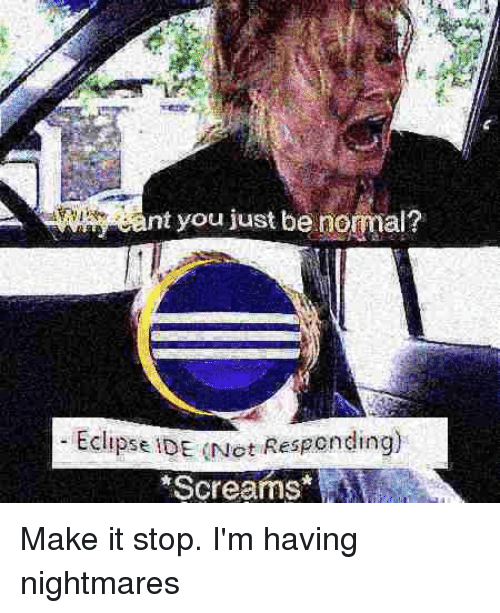

# Image describing my experience with the course:

Funniest subject this semester. Fuck Eclipse.

----
#### Table of Contents  
[Exams](https://github.com/Lekesoldat/NTNU/tree/master/TDT4100%20-%20Objektorientert%20Programmering/Exams)

- [Kont 2018](https://github.com/Lekesoldat/NTNU/tree/master/TDT4100%20-%20Objektorientert%20Programmering/Exams/Kont2018)
- [Kont 2017](https://github.com/Lekesoldat/NTNU/tree/master/TDT4100%20-%20Objektorientert%20Programmering/Exams/Kont2017)
- [2017](https://github.com/Lekesoldat/NTNU/tree/master/TDT4100%20-%20Objektorientert%20Programmering/Exams/2017)
- [2016](https://github.com/Lekesoldat/NTNU/tree/master/TDT4100%20-%20Objektorientert%20Programmering/Exams/2016)

[Exercises](https://github.com/Lekesoldat/NTNU/tree/master/TDT4100%20-%20Objektorientert%20Programmering/Exercises)

- [Exercise 1](https://github.com/Lekesoldat/NTNU/tree/master/TDT4100%20-%20Objektorientert%20Programmering/Exercises/O1)
  - Account
  - Digit
  - LineEditor
  - Location
  - UpOrDownCounter
- [Exercise 2](https://github.com/Lekesoldat/NTNU/tree/master/TDT4100%20-%20Objektorientert%20Programmering/Exercises/O2)
  - Account
  - Person
  - Vehicle
- [Exercise 3](https://github.com/Lekesoldat/NTNU/tree/master/TDT4100%20-%20Objektorientert%20Programmering/Exercises/O3)
  - Card
  - Nim
  - RPNCalc
- [Exercise 4](https://github.com/Lekesoldat/NTNU/tree/master/TDT4100%20-%20Objektorientert%20Programmering/Exercises/O4/app)
  - An app for sleep tracking.
- [Exercise 5](https://github.com/Lekesoldat/NTNU/tree/master/TDT4100%20-%20Objektorientert%20Programmering/Exercises/O5)
  - Card
  - Partner
  - Person
  - StopWatch
  - Twitter
- [Exercise 6](https://github.com/Lekesoldat/NTNU/tree/master/TDT4100%20-%20Objektorientert%20Programmering/Exercises/O6)
  - Card
  - Twitter
  - BinaryComputingIterator
  - Named
  - StringMergeIterator
- [Exercise 7](https://github.com/Lekesoldat/NTNU/tree/master/TDT4100%20-%20Objektorientert%20Programmering/Exercises/O7/app)
  - An app for sleep tracking continued.
- [Exercise 8](https://github.com/Lekesoldat/NTNU/tree/master/TDT4100%20-%20Objektorientert%20Programmering/Exercises/O8)
  - Delegation
    - The Office
    - Logger

  - Observable
    - Highscorelist
    - Stocklistener
- [Exercise 9](https://github.com/Lekesoldat/NTNU/tree/master/TDT4100%20-%20Objektorientert%20Programmering/Exercises/O9)
  - Inheritance
    - Train

  - Observable
    - ObservableList
- [Exercise 10](https://github.com/Lekesoldat/NTNU/tree/master/TDT4100%20-%20Objektorientert%20Programmering/Exercises/O10)
  - SleepEntryTest
  - WriteToFileTest

- [Lambda exercise from wiki](https://github.com/Lekesoldat/NTNU/tree/master/TDT4100%20-%20Objektorientert%20Programmering/Exercises/Lambda)

[Private learning](https://github.com/Lekesoldat/NTNU/tree/master/TDT4100%20-%20Objektorientert%20Programmering/Private)

- [[Unfinished] Expense Tracker](https://github.com/Lekesoldat/NTNU/tree/master/TDT4100%20-%20Objektorientert%20Programmering/Private/ExpenseTracker/src/main/java/ExpenseTracker)

- [[INTERMEDIATE] Self made linked list](https://github.com/Lekesoldat/NTNU/tree/master/TDT4100%20-%20Objektorientert%20Programmering/Private/LinkedListWithIterator/src)

- [[Exam practice] Legesystem](https://github.com/Lekesoldat/NTNU/tree/master/TDT4100%20-%20Objektorientert%20Programmering/Private/LinkedListWithIterator/src)

- [Random files](https://github.com/Lekesoldat/NTNU/tree/master/TDT4100%20-%20Objektorientert%20Programmering/Private/src)
  - Practising Streams
  - Practising I/O
