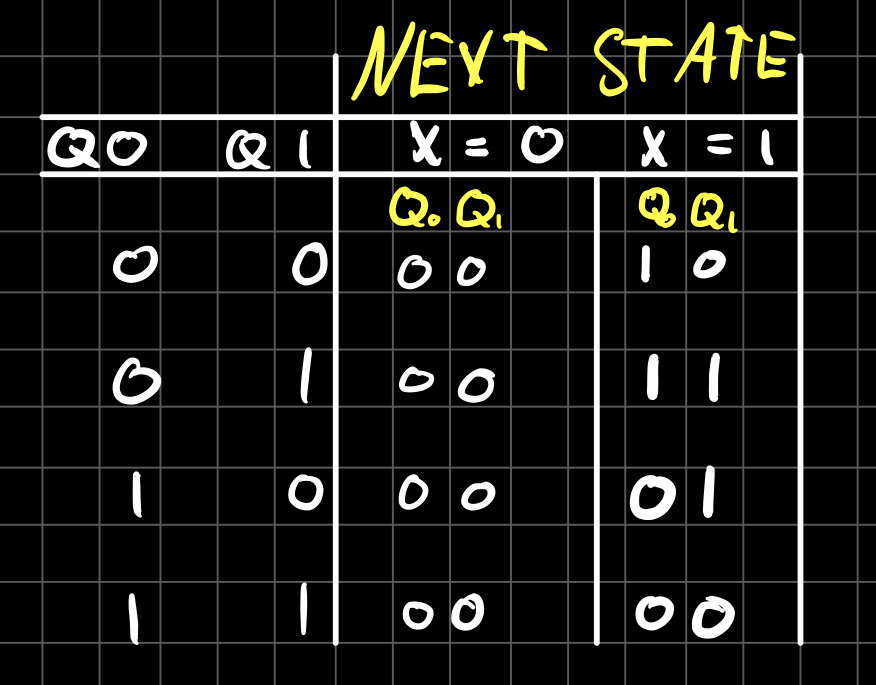

# Eksamensoppgave i TDT4160 datamaskiner og digitalteknikk, høsten 2015

## Oppgave 1: Oppstart, litt av vhert (25%)

a.  
**ISA** - (Instruction Set Architecture)  
Formel for klokkefrekvens = 1/t.  t = aksesstid
Ved pipelining angis klokkefrekvensen ved det tregeste steget.

Alternativ 1 uten pipeline:
- 1 / t = 1 / 40ns * 1000 = 25Mhz 

Alternativ 2 med pipeline:
- Stage 3 er tregest med 20ns.
- 1/20 * 1000 = 50Mhz

Alternativ 3 med pipeline:
- Stage 5 er tregest med 10ns.
- 1/10 * 1000 = 1000Mhz

Ved å ta hensyn til det tregeste steget, og beregne klokkeperioden ut i fra det, så vil vi se at det i alternativ 2 og alternativ 3 er mulig å øke klokkefrekvensen betraktelig i forhold til alternativ 1 der det ikke er pipeline. 

b.  
RAM aksesstid: *0.5µs.*  
Ny RAM (dobbelt så stor) aksesstid: *2µs*.  
Cache aksesstid: 0.025µs.  
Hit ratio (trefforholdstall) er 90%.

Ny gjennomsnittlig aksesstid:  

```math
Average Memory Access Time (AMAT) = Hit Latency (Cache access time) + Miss Rate (1 - hit rate) * Average Miss Penalty

= H + (1 - HR) * AMP
```

Hurtigbufferen prøver å ha data klart fra RAM. Dersom vi ikke finner dataen der (Miss rate kicker inn) så må den hente data helt fra RAM, og dette har en aksesstid på 2µs. 

c.  
En superscalar er en prosessor som lar deg utføre flere instruksjoner per klokkesyklus. Dette er da prosessorer med flere kjerner.

d.  
En SIMD-prosessor er en *Single Instruction stream Multiple Data stream*.  
Det er en parallellprosessorklasse der flere prosessorer utfører samme instruksjon på forskjellige data. Brukes ofte på arrays og grafikk.

e.  
**ILP** = Instruction Level Parallelism.  
**ISA** = Instruction Level Architecture.

ILP angir mengden instruksjoner som utføres samtidig. F.eks. pipelines med flere steg (dybde) vil få en høyere ILG enn med få steg.

ILP er *ikke* definert på ISA-nivå. ISA definerer instruksjonene logisk. En ISA kan ikke ha flere alternative mikroarkitekturer med forskjellig ytelse (med forskjellig ILP).


## Oppgave 2: Digitalt logisk nivå (25% (10 % PÅ A, 5 % PÅ B OG 10% PÅ C))

a.  
  i)
  ```
  A15 -> A0 == 16 bit address buss
  
  RAM 1:
  Dekod:
  0000 XXXX XXXX XXXX

  Høy:
  0000 1111 1111 1111 => Hex: 0FFF

  Lav:
  0000 0000 0000 0000 => Hex: 0000


  RAM 2:
  Dekod:
  1000 0XXX XXXX XXXX

  Høy:
  1000 0111 1111 1111 => Hex: 87FF

  Lav:
  1000 0000 0000 0000 => Hex: 8000

  
  ROM:
  Dekod:
  1111 XXXX XXXX XXXX

  Høy:
  1111 1111 1111 1111 => Hex: FFFF

  Lav:
  1111 0000 0000 0000 => Hex: F000

  ```

  ii)  
  Det er plass mellom RAM 1 og RAM 2.  
  Fra hex (1000 til 7FFF).

  Det er også plass mellom RAM 2 og ROM.  
  Fra hex (8800 til EFFF)

b.
1
Klokke på 500 000hz = 0.5Mhz.  
Én instruksjon per klokkeperiode.

1µs = 1 000 000hz.
Vi har en klokke på 500 000hz som vil si 2µs. (Du kan aksessere ROM 2 ganger per sykel)

Antall instruksjoner per sykel = Klokkefrekvens / Aksesstid  = 2µs / 1µs = 2  
Aksesstid = x  
Klokkefrekvens = 2 Mhz (2 000 000 Hz)  
Antall instruksjoner per sykel = >=1  


Antall instruksjoner per sykel = Klokkefrekvens / Aksesstid  = 2µs / 1µs = 2
**Instruksjon per sykel:** 1  
**Klokkefrekvens vi får oppgitt:** 2 000 000hz = 2Mhz = 0.5µs  
**Aksesstid på nårævrende ROM:** 1µs  
Da får vi at:

Skal ha 1:
0.5µs / 1µs = 2 =/= 1.

Dersom klokkefrekvensen er 2Mhz vil den starte en ny 'spørring' før ROM har blitt aksessert ferdig.  
For å fikse dette kan vi senke aksesstiden til x:

0.5µs / x = 1
x = 0.5µs.

Dersom ROM-brikken hadde hatt en aksesstid på 0.5µs ville det fungert, men det vil ikke fungere i dette tilfellet da den er 0.1µs.

c.  
  >i)    
    Dette er en Moore machine. Det er kun 'current state' som blir brukt for dekoding av utsignal. Det finnes ingen kobling mellom inngang og dekonding av state. Se på bilder i README-filen.  

  >ii)  
  

  >iii)  
    Y = Q0 XOR Q1. 


## Oppgave 3: MIKROARKITEKTUR OG MIKROINSTRUKSJONER (25% (5% PÅ A, 10% PÅ B OG C))

a.
  >i)  
    MBR kan ikke skrives til og MAR kan ikke leses fra. MIR og MPC er en del av kontrollenheten og er heller ikke tilgjengelig for programmereren.

  >ii)  
    **MAR:** - (Memory Address Register). Inneholder peker til en minnelokasjon. Eksternt dataminne.
    **MDR:** - (Memory Data Register). Inneholder data fra lokasjonen MAR peker på ved read og inneholder data til minnelokasjonen ved write.

b.  
  >i)  
    ALU: B. Skal gi ut det som kommer inn på B-inngangen.  
    C: MAR. Output fra ALU skal skrives til MAR fra C-bussen.  
    B: TOS. B-bussen skal gi data TOS.  


    ALU: 010100  
    C: 000000001  
    B: 0111  

  > ii)  
    ALU: B, C: H, B: LV (Mellomlagrer LV i H)  
    ALU: A + B, C: H, B: MDR (H = LV + MDR)  
    ALU: A + B, C: PC, B: PC (PC = H + PC)


c.  
  ```
  ”SP”: hex(0001) -> 0b001, 
  ”LV”: hex(0002) -> 0b0010, 
  ”CPP”: hex(0003) -> 0b0011, 
  ”TOS”: hex(0004) -> 0b0100, 
  ”OPC”: hex(0005) -> 0b0101, 
  ”H”: hex(FF0A) -> 0b1111111100001010.
  ```

  1: ALU: 010100, C: 100000000, Mem: 000 og B: 0110  
  ```
  ALU: B, C: H, MEM: Ikke noe, B: CPP 
  // H = CPP
  ```
  2: ALU: 011100, C: 101000000, Mem: 000 og B: 0111  
  ```
  ALU: OR, C: H og TOS, MEM: Ikke noe, B: TOS 
  // H = H OR TOS -> 0b0011 || 0b0100 = *0b0111*
  ```
  3: ALU: 001100, C: 001000000, Mem: 000 og B: 1000 
  ```
  ALU: AND, C: TOS, MEM: Ikke noe, B: OPC
  // TOS = H AND OPC -> 0b0111 && 0b0101 = *0b0101*
  ```

  H = 0b0111 = hex(0007)  
  OPC = 0b0101 = hex(0005) Uendret.

  ## OPPGAVE 4: INSTRUKSJONSSETT ARKITEKTUR (ISA)(25 % ((5 % PÅ A, B,C OG 10 % PÅ D))

  a.   
  >i) ***BZ*** =  Flow control. Conditional branch on zero. One address, no operand  
  >ii) ***RT*** = Flow Control, Return from branch., No Address, no operand

  b.  
  >i) ***MOVC***: Immediate. Operanden sin verdi er gitt som en operand (Den peker ikke på en adresse med en verdi). Dette gjelder offte hardkodede operander etc.  
  >ii) ***CP***: Register addressering. Hver operand er et register.

  c.  
  Ja, begge bruker 32 bits register som kilde for å adressere minne. 

  d.
- MOVC R1, 0x00 55; 
  ```
  R1 = 0x0055
  ```

- MOVC R2, 0x00 AA; 
  ```
  R2 = 0x00AA
  ```

- STORE R1, R2; 
  ```
  Innholdet i R1 lagres i addressen [R2], 0x00AA.
  ```

- ADD R1, R1, R3; 
  ```
  R1 = [R1], [R3]
  ```
- STORE R1, R3; 
  ```
  Innholdet i R1 lagres i [R3], ukjent adresse
  ```

- LOAD R1, R2 
  ```
  R1 = Innholdet på lokasjonen [R2], 0x00AA som er 0x0055 (Adressen i R2 peker på R1).
  ```

- INV R3, R3; 
  ```
  Inverterer R3.
  ```

- CMP R1, R2; 
  ```
  Sammenligner innholdet i R1 og R2. R1 = 0x0055, R2 = 0x00AA. De er ikke like, Z = 0.
  ```

- BZ R2;
  ```
  Vil ikke hoppe.
  ```

>i) Vil hoppe til adressen i R2.  
>ii) Nei, Z-flagget blir ikke satt.