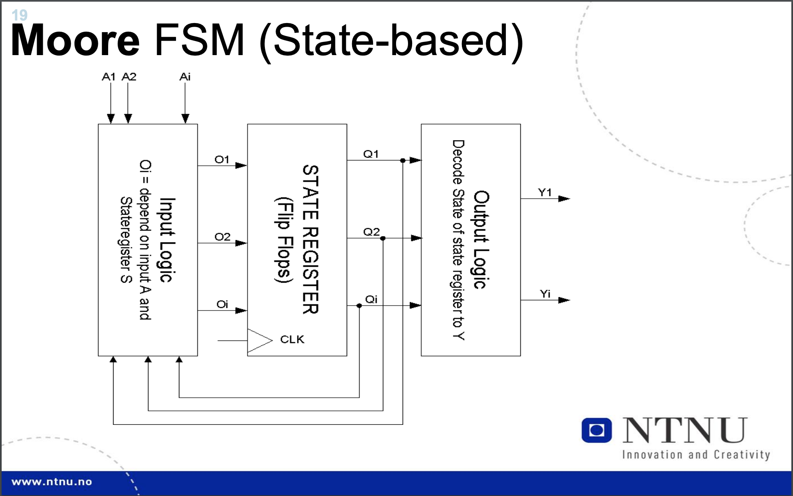
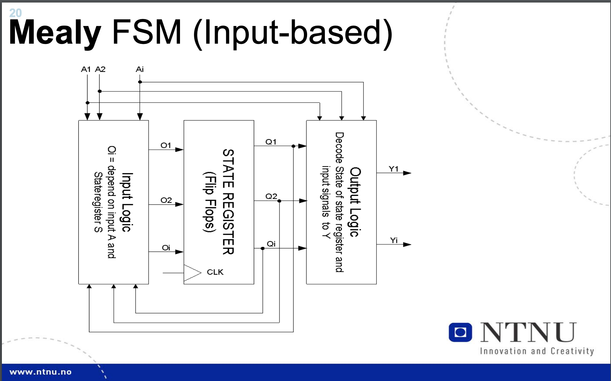

# Image describing my experience with the course:

  

Hardly understood anything until the last few days before the exam. True revelation right there.

---

- Ikke gå i forelesninger.
- Om du går i forelesninger, kos deg med dette: https://olavbb.com/ggk
- Øv på eksamensoppgaver, samme hvert år.

# Eksamensøving - (Takk [@niklasmh](https://github.com/niklasmh/ntnu/tree/master/TDT4160%20-%20Datamaskiner%20og%20Digitalteknikk/))

## Forkortelser og forklaringer

- **IJVM** - (Integer Java Virtual Machine)
- **ALU** - (Arithmetic Logic Unit)
- **MPC** - (Micro Program Counter)
- **P-ROM / PROM** - (Programmable Read Only Memory)
- **EP-ROM / EPROM** - (Eraseable Programmable Read Only Memory). En type ROM hvor innholdet slettes ved hjelp av sterkt utrafiolett lys (UV).
- **EEP-ROM / EEPROM** - (Electrically Erasable Programmable Read-Only Memory). ROM som kan omprogrammeres. Brukes ofte i mikrokontrollere.
- **ISA** - (Instruction Set Architecture)
  - **RISC** - (Reduced Instruction Set Computing). Utfører få instruksjoner, hver instruksjon tar kort tid.
    - **Instruksjonsstørrelse:** 1W eller to 'bytes'.
    - **Utføringstid:** Én sykel per instruksjon.
    - **Arbeid gjort:** Mindre arbeid per instruksjon.
    - **Intet mikroprogram:** Utfører heller instruksjonen direkte.
    - **Instruksjoner per program:** Mange. Enkle og primitive.
  - **CISC** - (Complex) Instruction Set Computing)
    - **Instruksjonsstørrelse:** Mange W.
    - **Utføringstid:** Gjennomsnittlig antal sykler per instruksjon er 2 til 15.
    - **Arbeid gjort:** Mye arbeid per instruksjon. Komplekse instruksjoner.
    - **Instruksjoner per program:** Førre enn RISC. Skyldes større og mer komplekse instruksjoner.
  
- **Mikroarchitecture**
  - **Von Neumann:**
    - *Instruksjoner* og *data* ligger i samme minnenhet.
    - Bruker samme BUS for instruksjoner og data. Simpelt design - færre komponenter. 
      - Beregninger skjer **sekvensielt** pga. dette.
    - Denne arkitekturen gjør det mulig å skrive program som kan endre sin egen programkode.
    - Komponentene er hver for seg.
      - 'Arbeidslager' som inneholder *data* og *instruksjoner* på **binær** form.
      - ALU som kunne utføre en del matematiske og logiske operasjoner.
      - Kontrollenhet(CPU) som tolker instruksjoner i minnet og sørger for utførelse.
      - I/O-enheter som sørger for kommunikasjon mellom bruker og kontrollenhet (CPU).
    - Utfordringen i dag er dataoverføring mellom minne og CPU. For stor hastighetsforskjell.

    - Moderne datamaskiner har ALU og kontrollenhet på prosessor (CPU) som benytter seg av registre, hurtigbuffere, busser og millioner av transistorer, men konseptet er veldig likt.

  - **Harward:**
    - Separert BUS for *instruksjoner* og *data*. Kan aksessere både *data* og *instruksjoner* i parallell.
    - Komponenter er hver for seg i parallell.
      - CPU
      - Instruksjonsminne
      - Dataminne

- **Superskalar CPU:**
  - En superskalar-prosessor implementerer en form for parallellitet som kalles *instruksjonsnivåparallellitet*. Dette betyr at den kan utføre flere instruksjoner per klokkesyklus. (Dupliserer CPU-enheter).

- **Hardware Components**
  - Valgfritt å ha med.
  - Eksempler:
    - **RAM** (Random Access Memory)
    - **ROM** (Read-Only Memory)
    - **I/O**-porter.

**LES MER PÅ DETTE**
- Mikro**prosessor**
  - ISA + Mikroarkitekturer

- Mikro**kontroller**
  - ISA + Mikroarkitektur + Harware Components

- **MIR** (Micro Instruction Register)
  - **Addr** - (Address) peker på neste mikroinstruksjon i instruksjonen.
  - **J** - (Jam) sier ifra om ALU har flagget neste mikrinstruksjon eller om det kommer et betinget hopp.
  - **ALU** - (Aritmethic Logic Unit) bestemmer hvilken funksjon ALU skal gjennomføre.
  - **C** - (C-BUS) inneholder adressen til C-BUSen => Adressen til registeret det skal skrives *til*.
  - **Mem** - (Memory) - sier ifra om det skal gjøres noe med minnet.
  - **B** - (B-BUS) inneholder adressen til B-BUSen => Adressen til registeret det skal leses *fra*.

- **Dataavhengigheter:**
  - **RAW** - (Read-After-Write) (sanne dataavhengigheter) er når f.eks. instruksjon 1 skriver til et register og instruksjon 2 skal lese fra det samme registeret.
  - **WAW** - (Write-After-Write) (utavhengigheter) er når f.eks. instruksjon 3 skriver til register 1 og instruksjon 1 skriver til register 1.
  - **WAR** - (Write-After-Read) antiavhengigheter) er når f.eks. instruksjon 3 skriver til register 1 og instruksjon 2 leser fra R1.

- **RAM** - (Random Access Memory)
  - **SRAM** - (Statisk RAM) er raskt og trenger ikke oppdateres. Brukes i *hurtigbuffere*.
  - **DRAM** - (Dynamisk RAM) må friskes opp jevnlig. Tar mindre plass enn SRAM (2 vs. 6 transistorer)
  - **SDRAM** - (Synkront Dynamisk RAM) betyr at data blir overført til/fra *RAM* synkront med klokken (og system**BUS**en).

- **CMP** - (Chip-Level MultiProsessor) er flere prosessorer på samme brikke. Disse bruker samme hurtigbuffer.
  - **Homogene kjerner** - alle kjernene er like.
  - **Heterogene kjerner** - forskjellige kjerner til forskjellige oppgaver, dvs de har forskjellig instruksjonssett og/eller ytelse.

  - Fordelen med CMP er lavere effekt/varmeutvikling, bedre utnyttelse av prosessorkraft, mulighet for 'ur av rekkefølge' og letter å utnytte 'instruksjonsnivåparallellitet'.

- **Adressering** - Måten instruksjonen angir hvor data skal hentes fra kalles en adresseringsmodus.
  - **Immidiate** - operanden er innbakt i instruksjonen Dersom operanden er kjent (en konstant) når programmet lages, kan verdien av denne legges inn i selve instruksjonen.
  - **Direkte** - Instruksjonen angir adressen til operand i RAM.
  - **Indirekte** - Instruksjonen angir adresse til RAM-celle som igjen inneholder adressen til operand.
  - **Register** - Instruksjon har nummer på register som inneholder operand. Populært å ruke.
  - **Indirekte register** - Instruksjon har nummer på register som inneholder adresse til operand i RAM.
  - **Stakk** - Adressen er implisitt gitt av stakkpeker.

- **Branch Prediction** - Forgreningspredikering
  - **Statisk** - forutsier hopp uavhengig av hvor hopp har forekommet før. Forutsier alltid/aldri hopp.
  - **Dynamisk** - forutsier hopp ut i fra hvor det har skjedd hopp tidligere.

- **IC** - (Integrated Circuit)
- **Multiplex - 2ⁿ** data inputs, *1* data output og *n* kontroll input.
- **Demultiplex - 1** datainput, **2ⁿ** data output og *n* kontroll input.
- **Half-adder** - A + B = sum + carry
- **Full-adder** - 2 Half-adders.
- **Klokkepuls:**
  - Vanligvis: 100Mhz - 4GHz.
  - Verdier: 0/1
  - Asymmetrisk (?)
  - Utfører operasjoner på 0, - 0 er derfor lengre enn 1.

- **Latency Hiding** - Cache brukes til dette for å øke ytelse. 

- **Lokalitet:**
  - **Tid** - om vi leste fra en minneadresse er det sannsynlig at vi snart vil lese fra den samme adressen igjen.
  - **Rom** - om vi leste fra en minneadresse er det sannsynlig at vi snart vil lese fra naboadressen

## Forkortelser: Register
- **PC** - (Program Counter) inneholder adressen til instruksjonen som utføres, eller neste instruksjon som skal utføres. Dette er avhengig av måten maskinen er bygd.
- **IR** - (Instruction Register) er der kontrollenheten lagrer instruksjonen som blig gjennomført nå. Den ligger i dette registeret så lenge instruksjonen blir dekodet, startet og gjennomført.
- **MAR** - (Memory Address Register) inneholder adresse til neste minnelokasjon der vi finner neste instruksjon.
- **MDR** - (Memory Data Register) inneholder data som skal bli lagret i hovedminne (RAM), eller data som har blitt hentet fra minnet. Dette virker som en buffer så data er klar for prosessor.
- **MBR** - (Memory Buffer Register) er et bufferregister mellom minne og prosessor.
- **LV** - (Local Variable) inneholder pekerverdi.
- **SP** - (Stack pointer) inneholder pekeverdi.
- **CPP** - (Constant Pool Pointer) inneholder pekerverdi.
- **TOS** - (Top of Stack) inneholder 'word' på toppen av stakken.
- **OPC** - (OpCode | Operation Code) register kan fritt brukes. F.eks. MOV, ADD, LOAD.
- **H** - (Holding Register) inneholder verdien som skal inn i A-inngangen til ALU.

## ALU-flagg
- **N** - settes når svaret fra ALU er negativt.
- **Z** - settes når svaret fra ALU er 0.
- **C** - carry. 
- **V** - overflow. 

## Instruksjon i Micro Program Memory
<pre>
. MPC
0000 0 0100
. . . . . . . .Shift ALU . . C buss . mem B buss
1: H  ← . . TOS: 00 010100 1000000000 000 0111
2: SP ← H + OPC: 00 111100 . 00001000 000 1000
</pre>

## Sekvensiell logikk

- **

## Relevant informasjon fra eksamenssett:

**Fra eksamen 2015:**  

- **IFU** - (Instruction Fetch Unit)
  - En del av IU (Instruction Unit) som igjen er en del av CPU.
  - Ansvarlig for *organisering* av programinstruksjoner som skal hentes fra minnet og utføres.

  - **Fetch cycle**:
    - Innholdet i PC (Program Counter) plasseres på adresse*BUS*en. 
    - Innholdet sendes til minneenheten, og minneenheten returnerer instruksjonen som er på gitt adresse.
    - Denne havner i IR (Instruction Register) og innholdet i PC blir overskrevet eller inkrementert med en ny verdi.

- **FSM** - (Finite State Machine) 
  - Matematisk modell som brukes for å designe dataprogrammer og *digitale logiske kretser*.
  - En abstrakt maskin som befinner seg i én av endelig antall tilstander.
  - En utløsende hendelse elelr betingelse kan få tilstandsmaskinen til å gå fra en tilstand til en annen -> 'transition'.

  - **Moore machine:**
    - Output blir kun bestemt av 'current state'. 

  - **Mealy machine:**
    - Output blir bestemt av både 'current state' og 'current input'.
    - Dette er en deterministisk tilstandsmaskin: *For hver state og input finnest det kun én 'transition'*.

