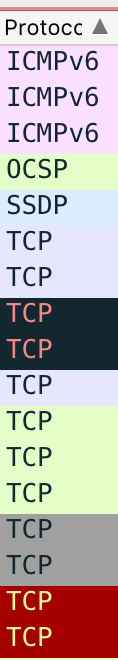
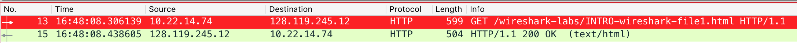
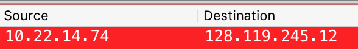
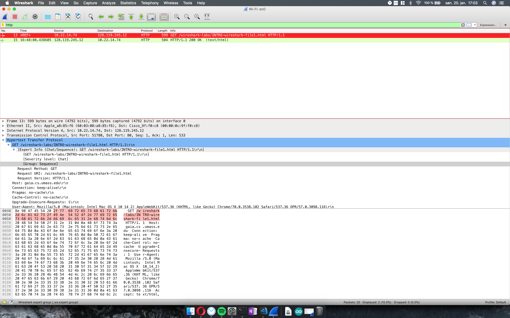

# Communication – Services and Networks
## Wireshark Lab: Intro

1. ***List 3 different protocols that appear in the protocol column in the unfiltered
packet-listing window in step 7 above.***

    -  TCP, TLSv1.2, DNS, ICMP, GQUIC, ICMPv6, 0CSP.
    - 

2. ***How long did it take from when the HTTP GET message was sent until the
HTTP OK reply was received? (By default, the value of the Time column in the
packet listing window is the amount of time, in seconds, since Wireshark
tracing began. To display the Time field in time-of-day format, select the
Wireshark View pull down menu, then select Time Display Format, then select
Time-of-day.)***

    - Det tok litt over et tidels sekund fra requesten ble sendt til OK var returnert.
    - 

3. ***What is the Internet address of the gaia.cs.umass.edu (also known as
www.net.cs.umass.edu)? What is the Internet address of your computer?***

    - Address to gaia.cs.umass.edu: 128.119.245.12
    - My local address: 10.22.14.74
    - 

4. ***Take screenshots of the two HTTP messages (GET and OK) referred to in
question 2 above. The screenshots should include the packet-header window for
these messages and the packet list window (see the beginning of this tutorial for
the descriptions of the different windows).***

    